# UMS Backend ER Diagram

Generated from Django models in `apps/*/models.py` and cross-checked against `docs/SCHEMA.md`.
The complete schema is large: **131 models** and **212 model relationships**. All explicitly declared model fields are shown in the entity blocks. Django-inherited auth fields and implicit timestamp fields from `TimestampedModel` are not repeated unless declared directly on the model.

## How to render

Paste any Mermaid block into <https://mermaid.live>, or view this Markdown in a renderer with Mermaid support.

## Main ERD

This is the core identity, organization, academic, student, employee, course, timetable, and grading shape.

```mermaid
erDiagram
    User {
        bigint id PK
        string email
        string middle_name
        string phone
        date date_of_birth
        string gender
        string blood_group
        string profile_photo
        string user_type
        string account_status
        bool email_verified
        bool phone_verified
        datetime password_changed_at
        datetime last_failed_login_at
        datetime last_seen_at
    }
    Role {
        bigint id PK
        string code
        string name
        text description
    }
    UserRole {
        bigint id PK
        bigint user_id FK
        bigint role_id FK
        datetime assigned_at
        bigint assigned_by_id FK
        datetime revoked_at
    }
    Address {
        bigint id PK
        string line1
        string line2
        string city
        string state
        string postal_code
        string country
    }
    UserAddress {
        bigint id PK
        bigint user_id FK
        bigint address_id FK
        string address_type
    }
    Document {
        bigint id PK
        bigint content_type_id FK
        bigint object_id
        string owner
        string name
        string doc_type
        string file
        bigint uploaded_by_id FK
        bool verified
        string mime_type
        bigint file_size
        datetime verified_at
        bigint verified_by_id FK
        bool is_private
    }
    EmergencyContact {
        bigint id PK
        bigint content_type_id FK
        bigint object_id
        string owner
        string name
        string relation
        string phone
        string email
        bigint address_id FK
        bool phone_verified
    }
    Currency {
        bigint id PK
        string code
        string name
        string symbol
        bool is_default
    }
    Institute {
        bigint id PK
        string name
        string short_code
        date established_on
        string logo
        string website
        string email
        string phone
        bigint address_id FK
    }
    Campus {
        bigint id PK
        bigint institute_id FK
        string name
        string code
        bigint address_id FK
    }
    School {
        bigint id PK
        bigint campus_id FK
        string name
        string code
        bigint dean_id FK
    }
    Department {
        bigint id PK
        bigint school_id FK
        string name
        string code
        bigint hod_id FK
    }
    AcademicYear {
        bigint id PK
        string name
        date start_date
        date end_date
        bool is_current
    }
    AcademicTerm {
        bigint id PK
        bigint academic_year_id FK
        string name
        string term_type
        date start_date
        date end_date
        bool is_current
    }
    Program {
        bigint id PK
        bigint department_id FK
        string name
        string code
        string level
        decimal duration_years
        int total_terms
        int total_credits
        bigint grading_scheme_id FK
        text description
    }
    Batch {
        bigint id PK
        bigint program_id FK
        string name
        int start_year
        int end_year
        int max_strength
    }
    Section {
        bigint id PK
        bigint batch_id FK
        bigint term_id FK
        string name
        bigint class_teacher_id FK
        int max_strength
    }
    Student {
        bigint id PK
        bigint user_id FK
        string enrollment_no
        string roll_no
        bigint program_id FK
        bigint batch_id FK
        bigint current_term_id FK
        bigint current_section_id FK
        date admission_date
        string admission_type
        string category
        string religion
        string nationality
        string blood_group
        string aadhaar_no
        string pan_no
        string status
    }
    Guardian {
        bigint id PK
        bigint user_id FK
        string name
        string relation
        string occupation
        decimal annual_income
        string phone
        string email
        bigint address_id FK
    }
    StudentGuardian {
        bigint id PK
        bigint student_id FK
        bigint guardian_id FK
        bool is_primary
    }
    StudentEnrollment {
        bigint id PK
        bigint student_id FK
        bigint offering_id FK
        date enrolled_on
        string status
    }
    Employee {
        bigint id PK
        bigint user_id FK
        string employee_no
        bigint department_id FK
        bigint designation_id FK
        bigint reports_to_id FK
        string employment_type
        date joining_date
        date confirmation_date
        date exit_date
        string status
        string pan_no
        string aadhaar_no
        string pf_no
        string uan_no
        string bank_account_no
        string bank_ifsc
    }
    Designation {
        bigint id PK
        string name
        string category
    }
    Course {
        bigint id PK
        bigint department_id FK
        string code
        string title
        decimal credits
        string course_type
        int theory_hours
        int practical_hours
        text description
        bigint prerequisites_ids FK
    }
    CoursePrerequisite {
        bigint id PK
        bigint course_id FK
        bigint prereq_course_id FK
    }
    ProgramCourse {
        bigint id PK
        bigint program_id FK
        bigint course_id FK
        int term_number
        bool is_mandatory
    }
    CourseOffering {
        bigint id PK
        bigint course_id FK
        bigint term_id FK
        bigint section_id FK
        bigint primary_teacher_id FK
        bigint room_id FK
        int capacity
    }
    TeachingAssignment {
        bigint id PK
        bigint offering_id FK
        bigint employee_id FK
        string role
    }
    SyllabusTopic {
        bigint id PK
        bigint course_id FK
        int unit_number
        string title
        text description
        decimal expected_hours
    }
    Room {
        bigint id PK
        bigint campus_id FK
        string building
        int floor
        string room_no
        string room_type
        int capacity
        bool has_projector
        bool has_ac
    }
    TimeSlot {
        bigint id PK
        int day_of_week
        time start_time
        time end_time
        string name
    }
    TimetableEntry {
        bigint id PK
        bigint section_id FK
        bigint offering_id FK
        bigint time_slot_id FK
        bigint teacher_id FK
        bigint room_id FK
        date effective_from
        date effective_to
    }
    GradingScheme {
        bigint id PK
        string name
        string scheme_type
        decimal max_grade_points
        decimal pass_threshold
        text description
    }
    GradeBand {
        bigint id PK
        bigint scheme_id FK
        string band_code
        decimal min_percentage
        decimal max_percentage
        decimal grade_points
        bool is_pass
        int sort_order
    }
    GradeConversionRule {
        bigint id PK
        bigint from_scheme_id FK
        bigint to_scheme_id FK
        string formula
        text description
    }
    AcademicTerm }o--|| AcademicYear : academic_year
    Program }o--|| Department : department
    Program }o--|| GradingScheme : grading_scheme
    Batch }o--|| Program : program
    Section }o--|| Batch : batch
    Section }o--|| AcademicTerm : term
    Section }o--|| Employee : class_teacher
    UserRole }o--|| User : user
    UserRole }o--|| Role : role
    UserRole }o--|| User : assigned_by
    UserAddress }o--|| User : user
    UserAddress }o--|| Address : address
    Document }o--|| User : uploaded_by
    Document }o--|| User : verified_by
    EmergencyContact }o--|| Address : address
    Course }o--|| Department : department
    Course }o--o{ Course : prerequisites
    CoursePrerequisite }o--|| Course : course
    CoursePrerequisite }o--|| Course : prereq_course
    ProgramCourse }o--|| Program : program
    ProgramCourse }o--|| Course : course
    CourseOffering }o--|| Course : course
    CourseOffering }o--|| AcademicTerm : term
    CourseOffering }o--|| Section : section
    CourseOffering }o--|| Employee : primary_teacher
    CourseOffering }o--|| Room : room
    TeachingAssignment }o--|| CourseOffering : offering
    TeachingAssignment }o--|| Employee : employee
    SyllabusTopic }o--|| Course : course
    Employee ||--|| User : user
    Employee }o--|| Department : department
    Employee }o--|| Designation : designation
    Employee }o--|| Employee : reports_to
    GradeBand }o--|| GradingScheme : scheme
    GradeConversionRule }o--|| GradingScheme : from_scheme
    GradeConversionRule }o--|| GradingScheme : to_scheme
    Institute }o--|| Address : address
    Campus }o--|| Institute : institute
    Campus }o--|| Address : address
    School }o--|| Campus : campus
    School }o--|| Employee : dean
    Department }o--|| School : school
    Department }o--|| Employee : hod
    Student ||--|| User : user
    Student }o--|| Program : program
    Student }o--|| Batch : batch
    Student }o--|| AcademicTerm : current_term
    Student }o--|| Section : current_section
    Guardian ||--|| User : user
    Guardian }o--|| Address : address
    StudentGuardian }o--|| Student : student
    StudentGuardian }o--|| Guardian : guardian
    StudentEnrollment }o--|| Student : student
    StudentEnrollment }o--|| CourseOffering : offering
    Room }o--|| Campus : campus
    TimetableEntry }o--|| Section : section
    TimetableEntry }o--|| CourseOffering : offering
    TimetableEntry }o--|| TimeSlot : time_slot
    TimetableEntry }o--|| Employee : teacher
    TimetableEntry }o--|| Room : room
```

## Full Relationship ERD

This contains every parsed relationship. It includes model names and relationship edges only, so the large graph has a better chance of rendering. Use the module diagrams below when you need every column.

```mermaid
erDiagram
    AcademicTerm {
        bigint id PK
    }
    AcademicYear {
        bigint id PK
    }
    AccountGroup {
        bigint id PK
    }
    Address {
        bigint id PK
    }
    Alumni {
        bigint id PK
    }
    AlumniDonation {
        bigint id PK
    }
    AlumniEvent {
        bigint id PK
    }
    AlumniEventAttendee {
        bigint id PK
    }
    Announcement {
        bigint id PK
    }
    Application {
        bigint id PK
    }
    Asset {
        bigint id PK
    }
    AssetAssignment {
        bigint id PK
    }
    AssetCategory {
        bigint id PK
    }
    Assignment {
        bigint id PK
    }
    AssignmentSubmission {
        bigint id PK
    }
    AttendanceSession {
        bigint id PK
    }
    AuditLog {
        bigint id PK
    }
    Author {
        bigint id PK
    }
    Batch {
        bigint id PK
    }
    Book {
        bigint id PK
    }
    BookAuthor {
        bigint id PK
    }
    BookCategory {
        bigint id PK
    }
    BookCopy {
        bigint id PK
    }
    BookIssue {
        bigint id PK
    }
    BookReservation {
        bigint id PK
    }
    Campus {
        bigint id PK
    }
    ChartOfAccount {
        bigint id PK
    }
    Company {
        bigint id PK
    }
    Course {
        bigint id PK
    }
    CourseMaterial {
        bigint id PK
    }
    CourseOffering {
        bigint id PK
    }
    CoursePrerequisite {
        bigint id PK
    }
    Currency {
        bigint id PK
    }
    Department {
        bigint id PK
    }
    Designation {
        bigint id PK
    }
    Document {
        bigint id PK
    }
    EmergencyContact {
        bigint id PK
    }
    Employee {
        bigint id PK
    }
    EmployeeAttendance {
        bigint id PK
    }
    EmployeeSalaryAssignment {
        bigint id PK
    }
    Event {
        bigint id PK
    }
    Exam {
        bigint id PK
    }
    ExamSchedule {
        bigint id PK
    }
    ExamType {
        bigint id PK
    }
    FeeCategory {
        bigint id PK
    }
    FeeHead {
        bigint id PK
    }
    FeeInvoice {
        bigint id PK
    }
    FeeInvoiceLine {
        bigint id PK
    }
    FeeStructure {
        bigint id PK
    }
    FeeStructureItem {
        bigint id PK
    }
    FiscalYear {
        bigint id PK
    }
    GradeBand {
        bigint id PK
    }
    GradeConversionRule {
        bigint id PK
    }
    GradingScheme {
        bigint id PK
    }
    Guardian {
        bigint id PK
    }
    Holiday {
        bigint id PK
    }
    HolidayList {
        bigint id PK
    }
    Hostel {
        bigint id PK
    }
    HostelApplication {
        bigint id PK
    }
    HostelBlock {
        bigint id PK
    }
    HostelFloor {
        bigint id PK
    }
    HostelLeave {
        bigint id PK
    }
    HostelRoom {
        bigint id PK
    }
    HostelVisitor {
        bigint id PK
    }
    Institute {
        bigint id PK
    }
    JobApplicant {
        bigint id PK
    }
    JobOpening {
        bigint id PK
    }
    JobPosting {
        bigint id PK
    }
    JournalEntry {
        bigint id PK
    }
    JournalLine {
        bigint id PK
    }
    LeaveApplication {
        bigint id PK
    }
    LeaveBalance {
        bigint id PK
    }
    LeavePolicy {
        bigint id PK
    }
    LeaveType {
        bigint id PK
    }
    LibraryFine {
        bigint id PK
    }
    LibraryMember {
        bigint id PK
    }
    Mess {
        bigint id PK
    }
    MessBill {
        bigint id PK
    }
    MessMenu {
        bigint id PK
    }
    Notification {
        bigint id PK
    }
    Payment {
        bigint id PK
    }
    Payslip {
        bigint id PK
    }
    PayslipLine {
        bigint id PK
    }
    PlacementApplication {
        bigint id PK
    }
    PlacementDrive {
        bigint id PK
    }
    PlacementInterviewResult {
        bigint id PK
    }
    PlacementInterviewRound {
        bigint id PK
    }
    PlacementOffer {
        bigint id PK
    }
    Program {
        bigint id PK
    }
    ProgramCourse {
        bigint id PK
    }
    Publisher {
        bigint id PK
    }
    Purchase {
        bigint id PK
    }
    PurchaseItem {
        bigint id PK
    }
    Qualification {
        bigint id PK
    }
    Question {
        bigint id PK
    }
    QuestionOption {
        bigint id PK
    }
    Quiz {
        bigint id PK
    }
    QuizAnswer {
        bigint id PK
    }
    QuizAttempt {
        bigint id PK
    }
    RecruitmentInterview {
        bigint id PK
    }
    RecruitmentOffer {
        bigint id PK
    }
    Refund {
        bigint id PK
    }
    Role {
        bigint id PK
    }
    Room {
        bigint id PK
    }
    RoomAllocation {
        bigint id PK
    }
    SalaryComponent {
        bigint id PK
    }
    SalaryStructure {
        bigint id PK
    }
    SalaryStructureComponent {
        bigint id PK
    }
    Scholarship {
        bigint id PK
    }
    School {
        bigint id PK
    }
    Section {
        bigint id PK
    }
    Setting {
        bigint id PK
    }
    Shift {
        bigint id PK
    }
    Student {
        bigint id PK
    }
    StudentAttendance {
        bigint id PK
    }
    StudentCourseResult {
        bigint id PK
    }
    StudentCumulativeResult {
        bigint id PK
    }
    StudentEnrollment {
        bigint id PK
    }
    StudentGuardian {
        bigint id PK
    }
    StudentMark {
        bigint id PK
    }
    StudentScholarship {
        bigint id PK
    }
    StudentTermResult {
        bigint id PK
    }
    SyllabusTopic {
        bigint id PK
    }
    TeachingAssignment {
        bigint id PK
    }
    TimeSlot {
        bigint id PK
    }
    TimetableEntry {
        bigint id PK
    }
    User {
        bigint id PK
    }
    UserAddress {
        bigint id PK
    }
    UserRole {
        bigint id PK
    }
    Vendor {
        bigint id PK
    }
    WorkExperience {
        bigint id PK
    }
    AcademicTerm }o--|| AcademicYear : academic_year
    Program }o--|| Department : department
    Program }o--|| GradingScheme : grading_scheme
    Batch }o--|| Program : program
    Section }o--|| Batch : batch
    Section }o--|| AcademicTerm : term
    Section }o--|| Employee : class_teacher
    AccountGroup }o--|| AccountGroup : parent
    ChartOfAccount }o--|| AccountGroup : group
    ChartOfAccount }o--|| Currency : currency
    JournalEntry }o--|| FiscalYear : fiscal_year
    JournalEntry }o--|| User : posted_by
    JournalLine }o--|| JournalEntry : entry
    JournalLine }o--|| ChartOfAccount : account
    Alumni ||--|| User : user
    Alumni ||--|| Student : student
    Alumni }o--|| Program : program
    Alumni }o--|| Batch : batch
    AlumniEventAttendee }o--|| AlumniEvent : event
    AlumniEventAttendee }o--|| Alumni : alumni
    AlumniDonation }o--|| Alumni : alumni
    AlumniDonation }o--|| JournalEntry : journal_entry
    Asset }o--|| AssetCategory : category
    Asset }o--|| Vendor : vendor
    AssetAssignment }o--|| Asset : asset
    Purchase }o--|| Vendor : vendor
    Purchase }o--|| JournalEntry : journal_entry
    PurchaseItem }o--|| Purchase : purchase
    PurchaseItem }o--|| Asset : asset
    AuditLog }o--|| User : actor
    Announcement }o--|| Department : department
    Announcement }o--|| Program : program
    Announcement }o--|| Batch : batch
    Announcement }o--|| User : author
    Notification }o--|| User : recipient
    UserRole }o--|| User : user
    UserRole }o--|| Role : role
    UserRole }o--|| User : assigned_by
    UserAddress }o--|| User : user
    UserAddress }o--|| Address : address
    Document }o--|| User : uploaded_by
    Document }o--|| User : verified_by
    EmergencyContact }o--|| Address : address
    Course }o--|| Department : department
    Course }o--o{ Course : prerequisites
    CoursePrerequisite }o--|| Course : course
    CoursePrerequisite }o--|| Course : prereq_course
    ProgramCourse }o--|| Program : program
    ProgramCourse }o--|| Course : course
    CourseOffering }o--|| Course : course
    CourseOffering }o--|| AcademicTerm : term
    CourseOffering }o--|| Section : section
    CourseOffering }o--|| Employee : primary_teacher
    CourseOffering }o--|| Room : room
    TeachingAssignment }o--|| CourseOffering : offering
    TeachingAssignment }o--|| Employee : employee
    SyllabusTopic }o--|| Course : course
    Employee ||--|| User : user
    Employee }o--|| Department : department
    Employee }o--|| Designation : designation
    Employee }o--|| Employee : reports_to
    Qualification }o--|| Employee : employee
    WorkExperience }o--|| Employee : employee
    Exam }o--|| AcademicTerm : term
    Exam }o--|| ExamType : exam_type
    ExamSchedule }o--|| Exam : exam
    ExamSchedule }o--|| CourseOffering : offering
    ExamSchedule }o--|| Room : room
    StudentMark }o--|| ExamSchedule : schedule
    StudentMark }o--|| Student : student
    StudentCourseResult ||--|| StudentEnrollment : enrollment
    StudentCourseResult }o--|| GradeBand : grade_band
    StudentTermResult }o--|| Student : student
    StudentTermResult }o--|| AcademicTerm : term
    StudentCumulativeResult ||--|| Student : student
    FeeHead }o--|| FeeCategory : category
    FeeStructure }o--|| Program : program
    FeeStructure }o--|| Batch : batch
    FeeStructure }o--|| AcademicTerm : term
    FeeStructureItem }o--|| FeeStructure : structure
    FeeStructureItem }o--|| FeeHead : fee_head
    FeeInvoice }o--|| Student : student
    FeeInvoice }o--|| AcademicTerm : term
    FeeInvoice }o--|| JournalEntry : journal_entry
    FeeInvoiceLine }o--|| FeeInvoice : invoice
    FeeInvoiceLine }o--|| FeeHead : fee_head
    Payment }o--|| FeeInvoice : invoice
    Payment }o--|| Employee : received_by
    Payment }o--|| JournalEntry : journal_entry
    StudentScholarship }o--|| Student : student
    StudentScholarship }o--|| Scholarship : scholarship
    StudentScholarship }o--|| Employee : approved_by
    Refund }o--|| Payment : payment
    Refund }o--|| JournalEntry : journal_entry
    GradeBand }o--|| GradingScheme : scheme
    GradeConversionRule }o--|| GradingScheme : from_scheme
    GradeConversionRule }o--|| GradingScheme : to_scheme
    Hostel }o--|| Campus : campus
    Hostel }o--|| Employee : warden
    HostelBlock }o--|| Hostel : hostel
    HostelFloor }o--|| HostelBlock : block
    HostelRoom }o--|| HostelFloor : floor
    HostelApplication }o--|| Student : student
    HostelApplication }o--|| Hostel : preferred_hostel
    HostelApplication }o--|| AcademicYear : academic_year
    RoomAllocation }o--|| Student : student
    RoomAllocation }o--|| HostelRoom : room
    Mess }o--|| Hostel : hostel
    MessMenu }o--|| Mess : mess
    MessBill }o--|| Student : student
    MessBill }o--|| Mess : mess
    HostelVisitor }o--|| Student : student
    HostelLeave }o--|| Student : student
    HostelLeave }o--|| Employee : approved_by
    LeavePolicy }o--|| LeaveType : leave_type
    LeavePolicy }o--|| Designation : designation
    LeaveBalance }o--|| Employee : employee
    LeaveBalance }o--|| LeaveType : leave_type
    LeaveApplication }o--|| Employee : employee
    LeaveApplication }o--|| LeaveType : leave_type
    LeaveApplication }o--|| Employee : approved_by
    HolidayList }o--|| AcademicYear : academic_year
    Holiday }o--|| HolidayList : holiday_list
    EmployeeAttendance }o--|| Employee : employee
    EmployeeAttendance }o--|| Shift : shift
    Book }o--|| Publisher : publisher
    Book }o--|| BookCategory : category
    Book }o--o{ Author : authors
    BookAuthor }o--|| Book : book
    BookAuthor }o--|| Author : author
    BookCopy }o--|| Book : book
    LibraryMember ||--|| User : user
    BookIssue }o--|| BookCopy : copy
    BookIssue }o--|| LibraryMember : member
    BookReservation }o--|| Book : book
    BookReservation }o--|| LibraryMember : member
    LibraryFine }o--|| BookIssue : issue
    LibraryFine }o--|| JournalEntry : journal_entry
    CourseMaterial }o--|| CourseOffering : offering
    CourseMaterial }o--|| Employee : uploaded_by
    Assignment }o--|| CourseOffering : offering
    AssignmentSubmission }o--|| Assignment : assignment
    AssignmentSubmission }o--|| Student : student
    AssignmentSubmission }o--|| Employee : graded_by
    Quiz }o--|| CourseOffering : offering
    Question }o--|| Quiz : quiz
    QuestionOption }o--|| Question : question
    QuizAttempt }o--|| Quiz : quiz
    QuizAttempt }o--|| Student : student
    QuizAnswer }o--|| QuizAttempt : attempt
    QuizAnswer }o--|| Question : question
    QuizAnswer }o--o{ QuestionOption : selected_options
    Institute }o--|| Address : address
    Campus }o--|| Institute : institute
    Campus }o--|| Address : address
    School }o--|| Campus : campus
    School }o--|| Employee : dean
    Department }o--|| School : school
    Department }o--|| Employee : hod
    SalaryStructureComponent }o--|| SalaryStructure : structure
    SalaryStructureComponent }o--|| SalaryComponent : component
    SalaryStructureComponent }o--|| SalaryComponent : percentage_of
    EmployeeSalaryAssignment }o--|| Employee : employee
    EmployeeSalaryAssignment }o--|| SalaryStructure : structure
    Payslip }o--|| Employee : employee
    Payslip }o--|| JournalEntry : journal_entry
    PayslipLine }o--|| Payslip : payslip
    PayslipLine }o--|| SalaryComponent : component
    PlacementDrive }o--|| Company : company
    PlacementDrive }o--|| AcademicYear : academic_year
    JobPosting }o--|| PlacementDrive : drive
    JobPosting }o--o{ Program : eligible_programs
    PlacementApplication }o--|| JobPosting : posting
    PlacementApplication }o--|| Student : student
    PlacementInterviewRound }o--|| JobPosting : posting
    PlacementInterviewResult }o--|| PlacementApplication : application
    PlacementInterviewResult }o--|| PlacementInterviewRound : round
    PlacementOffer ||--|| PlacementApplication : application
    JobOpening }o--|| Department : department
    JobOpening }o--|| Designation : designation
    JobApplicant }o--|| JobOpening : opening
    RecruitmentInterview }o--|| JobApplicant : applicant
    RecruitmentInterview }o--|| Employee : interviewer
    RecruitmentOffer ||--|| JobApplicant : applicant
    AttendanceSession }o--|| CourseOffering : offering
    AttendanceSession }o--|| Room : room
    AttendanceSession }o--|| Employee : taken_by
    StudentAttendance }o--|| AttendanceSession : session
    StudentAttendance }o--|| Student : student
    Application }o--|| Program : program
    Student ||--|| User : user
    Student }o--|| Program : program
    Student }o--|| Batch : batch
    Student }o--|| AcademicTerm : current_term
    Student }o--|| Section : current_section
    Guardian ||--|| User : user
    Guardian }o--|| Address : address
    StudentGuardian }o--|| Student : student
    StudentGuardian }o--|| Guardian : guardian
    StudentEnrollment }o--|| Student : student
    StudentEnrollment }o--|| CourseOffering : offering
    Room }o--|| Campus : campus
    TimetableEntry }o--|| Section : section
    TimetableEntry }o--|| CourseOffering : offering
    TimetableEntry }o--|| TimeSlot : time_slot
    TimetableEntry }o--|| Employee : teacher
    TimetableEntry }o--|| Room : room
```

## Module Diagrams

### academic

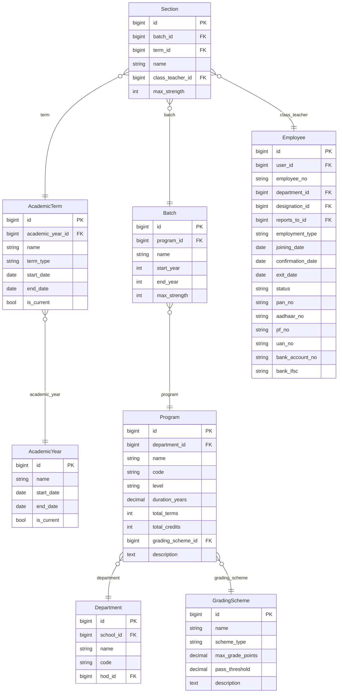
```mermaid
erDiagram
    AcademicTerm {
        bigint id PK
        bigint academic_year_id FK
        string name
        string term_type
        date start_date
        date end_date
        bool is_current
    }
    AcademicYear {
        bigint id PK
        string name
        date start_date
        date end_date
        bool is_current
    }
    Batch {
        bigint id PK
        bigint program_id FK
        string name
        int start_year
        int end_year
        int max_strength
    }
    Department {
        bigint id PK
        bigint school_id FK
        string name
        string code
        bigint hod_id FK
    }
    Employee {
        bigint id PK
        bigint user_id FK
        string employee_no
        bigint department_id FK
        bigint designation_id FK
        bigint reports_to_id FK
        string employment_type
        date joining_date
        date confirmation_date
        date exit_date
        string status
        string pan_no
        string aadhaar_no
        string pf_no
        string uan_no
        string bank_account_no
        string bank_ifsc
    }
    GradingScheme {
        bigint id PK
        string name
        string scheme_type
        decimal max_grade_points
        decimal pass_threshold
        text description
    }
    Program {
        bigint id PK
        bigint department_id FK
        string name
        string code
        string level
        decimal duration_years
        int total_terms
        int total_credits
        bigint grading_scheme_id FK
        text description
    }
    Section {
        bigint id PK
        bigint batch_id FK
        bigint term_id FK
        string name
        bigint class_teacher_id FK
        int max_strength
    }
    AcademicTerm }o--|| AcademicYear : academic_year
    Program }o--|| Department : department
    Program }o--|| GradingScheme : grading_scheme
    Batch }o--|| Program : program
    Section }o--|| Batch : batch
    Section }o--|| AcademicTerm : term
    Section }o--|| Employee : class_teacher
```

### accounting

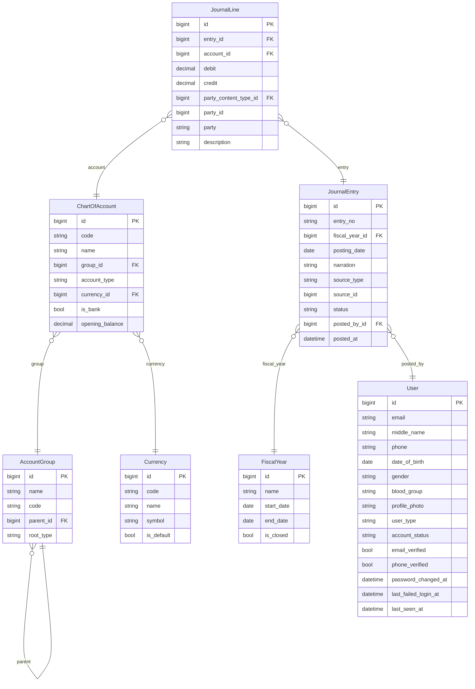
```mermaid
erDiagram
    AccountGroup {
        bigint id PK
        string name
        string code
        bigint parent_id FK
        string root_type
    }
    ChartOfAccount {
        bigint id PK
        string code
        string name
        bigint group_id FK
        string account_type
        bigint currency_id FK
        bool is_bank
        decimal opening_balance
    }
    Currency {
        bigint id PK
        string code
        string name
        string symbol
        bool is_default
    }
    FiscalYear {
        bigint id PK
        string name
        date start_date
        date end_date
        bool is_closed
    }
    JournalEntry {
        bigint id PK
        string entry_no
        bigint fiscal_year_id FK
        date posting_date
        string narration
        string source_type
        bigint source_id
        string status
        bigint posted_by_id FK
        datetime posted_at
    }
    JournalLine {
        bigint id PK
        bigint entry_id FK
        bigint account_id FK
        decimal debit
        decimal credit
        bigint party_content_type_id FK
        bigint party_id
        string party
        string description
    }
    User {
        bigint id PK
        string email
        string middle_name
        string phone
        date date_of_birth
        string gender
        string blood_group
        string profile_photo
        string user_type
        string account_status
        bool email_verified
        bool phone_verified
        datetime password_changed_at
        datetime last_failed_login_at
        datetime last_seen_at
    }
    AccountGroup }o--|| AccountGroup : parent
    ChartOfAccount }o--|| AccountGroup : group
    ChartOfAccount }o--|| Currency : currency
    JournalEntry }o--|| FiscalYear : fiscal_year
    JournalEntry }o--|| User : posted_by
    JournalLine }o--|| JournalEntry : entry
    JournalLine }o--|| ChartOfAccount : account
```

### alumni

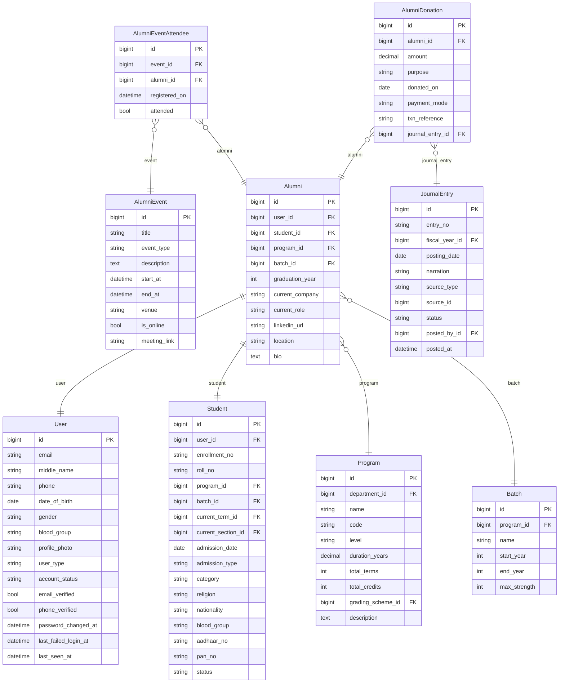
```mermaid
erDiagram
    Alumni {
        bigint id PK
        bigint user_id FK
        bigint student_id FK
        bigint program_id FK
        bigint batch_id FK
        int graduation_year
        string current_company
        string current_role
        string linkedin_url
        string location
        text bio
    }
    AlumniDonation {
        bigint id PK
        bigint alumni_id FK
        decimal amount
        string purpose
        date donated_on
        string payment_mode
        string txn_reference
        bigint journal_entry_id FK
    }
    AlumniEvent {
        bigint id PK
        string title
        string event_type
        text description
        datetime start_at
        datetime end_at
        string venue
        bool is_online
        string meeting_link
    }
    AlumniEventAttendee {
        bigint id PK
        bigint event_id FK
        bigint alumni_id FK
        datetime registered_on
        bool attended
    }
    Batch {
        bigint id PK
        bigint program_id FK
        string name
        int start_year
        int end_year
        int max_strength
    }
    JournalEntry {
        bigint id PK
        string entry_no
        bigint fiscal_year_id FK
        date posting_date
        string narration
        string source_type
        bigint source_id
        string status
        bigint posted_by_id FK
        datetime posted_at
    }
    Program {
        bigint id PK
        bigint department_id FK
        string name
        string code
        string level
        decimal duration_years
        int total_terms
        int total_credits
        bigint grading_scheme_id FK
        text description
    }
    Student {
        bigint id PK
        bigint user_id FK
        string enrollment_no
        string roll_no
        bigint program_id FK
        bigint batch_id FK
        bigint current_term_id FK
        bigint current_section_id FK
        date admission_date
        string admission_type
        string category
        string religion
        string nationality
        string blood_group
        string aadhaar_no
        string pan_no
        string status
    }
    User {
        bigint id PK
        string email
        string middle_name
        string phone
        date date_of_birth
        string gender
        string blood_group
        string profile_photo
        string user_type
        string account_status
        bool email_verified
        bool phone_verified
        datetime password_changed_at
        datetime last_failed_login_at
        datetime last_seen_at
    }
    Alumni ||--|| User : user
    Alumni ||--|| Student : student
    Alumni }o--|| Program : program
    Alumni }o--|| Batch : batch
    AlumniEventAttendee }o--|| AlumniEvent : event
    AlumniEventAttendee }o--|| Alumni : alumni
    AlumniDonation }o--|| Alumni : alumni
    AlumniDonation }o--|| JournalEntry : journal_entry
```

### assets

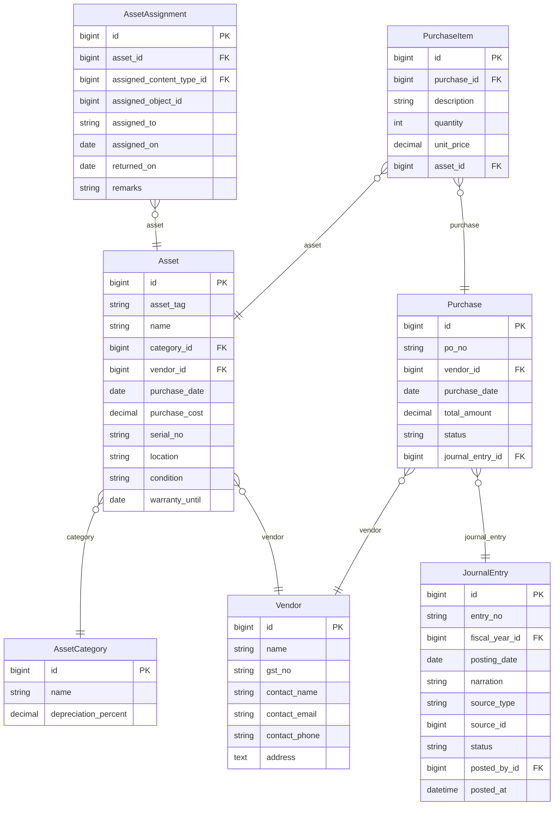
```mermaid
erDiagram
    Asset {
        bigint id PK
        string asset_tag
        string name
        bigint category_id FK
        bigint vendor_id FK
        date purchase_date
        decimal purchase_cost
        string serial_no
        string location
        string condition
        date warranty_until
    }
    AssetAssignment {
        bigint id PK
        bigint asset_id FK
        bigint assigned_content_type_id FK
        bigint assigned_object_id
        string assigned_to
        date assigned_on
        date returned_on
        string remarks
    }
    AssetCategory {
        bigint id PK
        string name
        decimal depreciation_percent
    }
    JournalEntry {
        bigint id PK
        string entry_no
        bigint fiscal_year_id FK
        date posting_date
        string narration
        string source_type
        bigint source_id
        string status
        bigint posted_by_id FK
        datetime posted_at
    }
    Purchase {
        bigint id PK
        string po_no
        bigint vendor_id FK
        date purchase_date
        decimal total_amount
        string status
        bigint journal_entry_id FK
    }
    PurchaseItem {
        bigint id PK
        bigint purchase_id FK
        string description
        int quantity
        decimal unit_price
        bigint asset_id FK
    }
    Vendor {
        bigint id PK
        string name
        string gst_no
        string contact_name
        string contact_email
        string contact_phone
        text address
    }
    Asset }o--|| AssetCategory : category
    Asset }o--|| Vendor : vendor
    AssetAssignment }o--|| Asset : asset
    Purchase }o--|| Vendor : vendor
    Purchase }o--|| JournalEntry : journal_entry
    PurchaseItem }o--|| Purchase : purchase
    PurchaseItem }o--|| Asset : asset
```

### audit

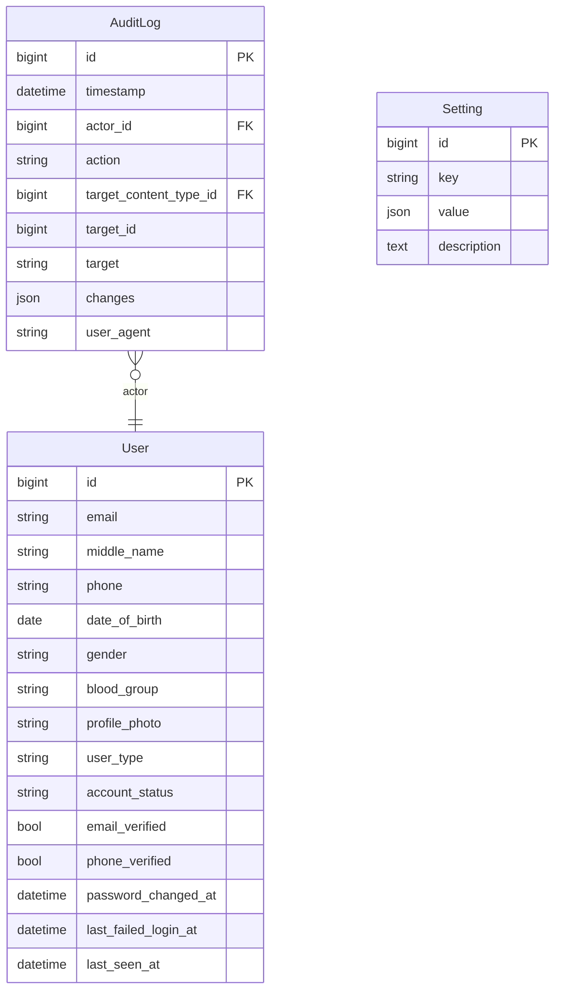
```mermaid
erDiagram
    AuditLog {
        bigint id PK
        datetime timestamp
        bigint actor_id FK
        string action
        bigint target_content_type_id FK
        bigint target_id
        string target
        json changes
        string user_agent
    }
    Setting {
        bigint id PK
        string key
        json value
        text description
    }
    User {
        bigint id PK
        string email
        string middle_name
        string phone
        date date_of_birth
        string gender
        string blood_group
        string profile_photo
        string user_type
        string account_status
        bool email_verified
        bool phone_verified
        datetime password_changed_at
        datetime last_failed_login_at
        datetime last_seen_at
    }
    AuditLog }o--|| User : actor
```

### communication

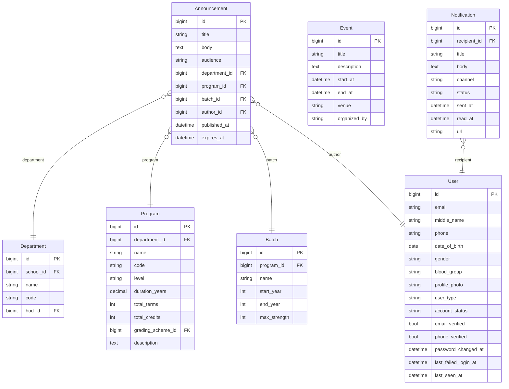
```mermaid
erDiagram
    Announcement {
        bigint id PK
        string title
        text body
        string audience
        bigint department_id FK
        bigint program_id FK
        bigint batch_id FK
        bigint author_id FK
        datetime published_at
        datetime expires_at
    }
    Batch {
        bigint id PK
        bigint program_id FK
        string name
        int start_year
        int end_year
        int max_strength
    }
    Department {
        bigint id PK
        bigint school_id FK
        string name
        string code
        bigint hod_id FK
    }
    Event {
        bigint id PK
        string title
        text description
        datetime start_at
        datetime end_at
        string venue
        string organized_by
    }
    Notification {
        bigint id PK
        bigint recipient_id FK
        string title
        text body
        string channel
        string status
        datetime sent_at
        datetime read_at
        string url
    }
    Program {
        bigint id PK
        bigint department_id FK
        string name
        string code
        string level
        decimal duration_years
        int total_terms
        int total_credits
        bigint grading_scheme_id FK
        text description
    }
    User {
        bigint id PK
        string email
        string middle_name
        string phone
        date date_of_birth
        string gender
        string blood_group
        string profile_photo
        string user_type
        string account_status
        bool email_verified
        bool phone_verified
        datetime password_changed_at
        datetime last_failed_login_at
        datetime last_seen_at
    }
    Announcement }o--|| Department : department
    Announcement }o--|| Program : program
    Announcement }o--|| Batch : batch
    Announcement }o--|| User : author
    Notification }o--|| User : recipient
```

### core

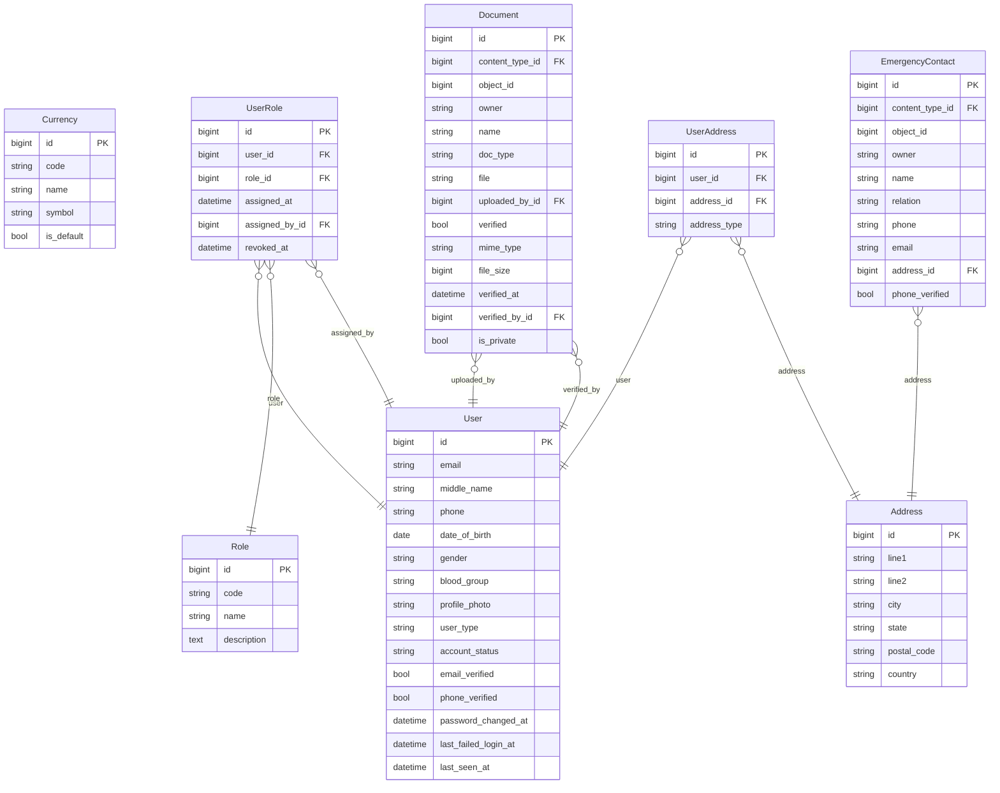
```mermaid
erDiagram
    Address {
        bigint id PK
        string line1
        string line2
        string city
        string state
        string postal_code
        string country
    }
    Currency {
        bigint id PK
        string code
        string name
        string symbol
        bool is_default
    }
    Document {
        bigint id PK
        bigint content_type_id FK
        bigint object_id
        string owner
        string name
        string doc_type
        string file
        bigint uploaded_by_id FK
        bool verified
        string mime_type
        bigint file_size
        datetime verified_at
        bigint verified_by_id FK
        bool is_private
    }
    EmergencyContact {
        bigint id PK
        bigint content_type_id FK
        bigint object_id
        string owner
        string name
        string relation
        string phone
        string email
        bigint address_id FK
        bool phone_verified
    }
    Role {
        bigint id PK
        string code
        string name
        text description
    }
    User {
        bigint id PK
        string email
        string middle_name
        string phone
        date date_of_birth
        string gender
        string blood_group
        string profile_photo
        string user_type
        string account_status
        bool email_verified
        bool phone_verified
        datetime password_changed_at
        datetime last_failed_login_at
        datetime last_seen_at
    }
    UserAddress {
        bigint id PK
        bigint user_id FK
        bigint address_id FK
        string address_type
    }
    UserRole {
        bigint id PK
        bigint user_id FK
        bigint role_id FK
        datetime assigned_at
        bigint assigned_by_id FK
        datetime revoked_at
    }
    UserRole }o--|| User : user
    UserRole }o--|| Role : role
    UserRole }o--|| User : assigned_by
    UserAddress }o--|| User : user
    UserAddress }o--|| Address : address
    Document }o--|| User : uploaded_by
    Document }o--|| User : verified_by
    EmergencyContact }o--|| Address : address
```

### courses

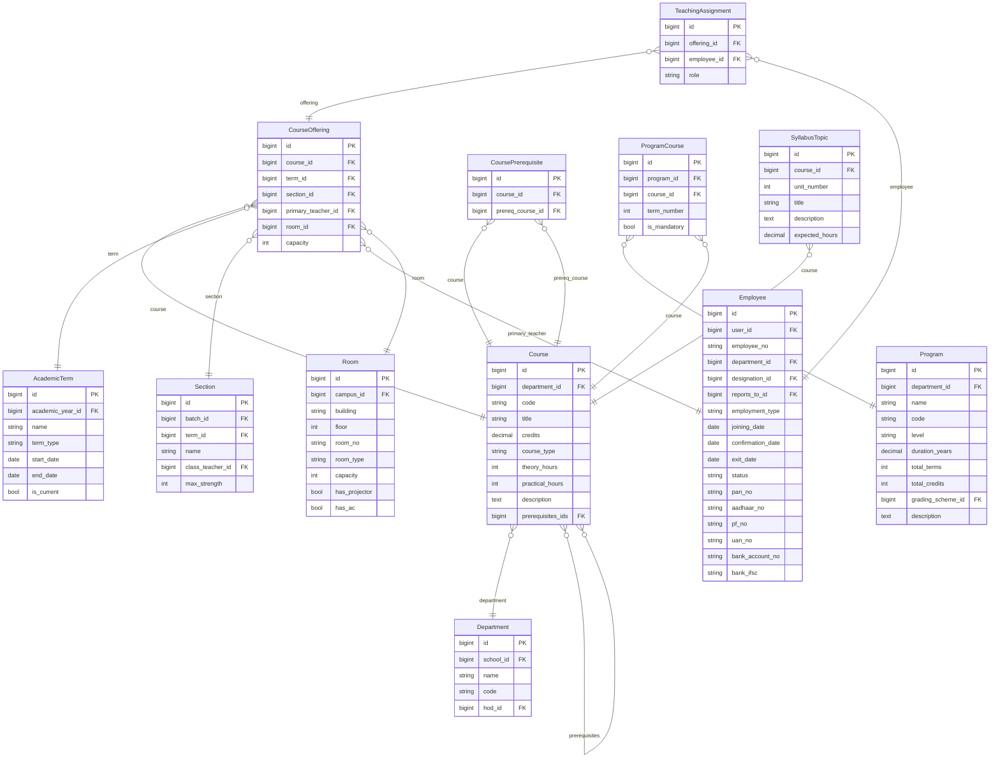
```mermaid
erDiagram
    AcademicTerm {
        bigint id PK
        bigint academic_year_id FK
        string name
        string term_type
        date start_date
        date end_date
        bool is_current
    }
    Course {
        bigint id PK
        bigint department_id FK
        string code
        string title
        decimal credits
        string course_type
        int theory_hours
        int practical_hours
        text description
        bigint prerequisites_ids FK
    }
    CourseOffering {
        bigint id PK
        bigint course_id FK
        bigint term_id FK
        bigint section_id FK
        bigint primary_teacher_id FK
        bigint room_id FK
        int capacity
    }
    CoursePrerequisite {
        bigint id PK
        bigint course_id FK
        bigint prereq_course_id FK
    }
    Department {
        bigint id PK
        bigint school_id FK
        string name
        string code
        bigint hod_id FK
    }
    Employee {
        bigint id PK
        bigint user_id FK
        string employee_no
        bigint department_id FK
        bigint designation_id FK
        bigint reports_to_id FK
        string employment_type
        date joining_date
        date confirmation_date
        date exit_date
        string status
        string pan_no
        string aadhaar_no
        string pf_no
        string uan_no
        string bank_account_no
        string bank_ifsc
    }
    Program {
        bigint id PK
        bigint department_id FK
        string name
        string code
        string level
        decimal duration_years
        int total_terms
        int total_credits
        bigint grading_scheme_id FK
        text description
    }
    ProgramCourse {
        bigint id PK
        bigint program_id FK
        bigint course_id FK
        int term_number
        bool is_mandatory
    }
    Room {
        bigint id PK
        bigint campus_id FK
        string building
        int floor
        string room_no
        string room_type
        int capacity
        bool has_projector
        bool has_ac
    }
    Section {
        bigint id PK
        bigint batch_id FK
        bigint term_id FK
        string name
        bigint class_teacher_id FK
        int max_strength
    }
    SyllabusTopic {
        bigint id PK
        bigint course_id FK
        int unit_number
        string title
        text description
        decimal expected_hours
    }
    TeachingAssignment {
        bigint id PK
        bigint offering_id FK
        bigint employee_id FK
        string role
    }
    Course }o--|| Department : department
    Course }o--o{ Course : prerequisites
    CoursePrerequisite }o--|| Course : course
    CoursePrerequisite }o--|| Course : prereq_course
    ProgramCourse }o--|| Program : program
    ProgramCourse }o--|| Course : course
    CourseOffering }o--|| Course : course
    CourseOffering }o--|| AcademicTerm : term
    CourseOffering }o--|| Section : section
    CourseOffering }o--|| Employee : primary_teacher
    CourseOffering }o--|| Room : room
    TeachingAssignment }o--|| CourseOffering : offering
    TeachingAssignment }o--|| Employee : employee
    SyllabusTopic }o--|| Course : course
```

### employees

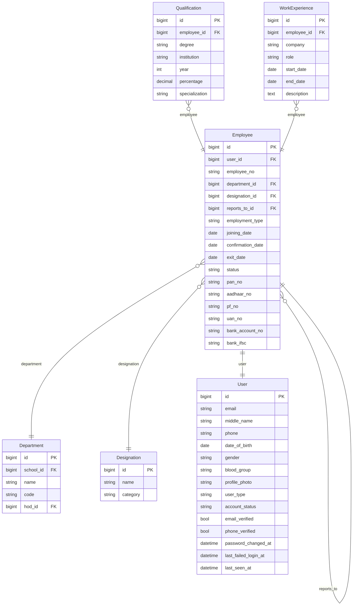
```mermaid
erDiagram
    Department {
        bigint id PK
        bigint school_id FK
        string name
        string code
        bigint hod_id FK
    }
    Designation {
        bigint id PK
        string name
        string category
    }
    Employee {
        bigint id PK
        bigint user_id FK
        string employee_no
        bigint department_id FK
        bigint designation_id FK
        bigint reports_to_id FK
        string employment_type
        date joining_date
        date confirmation_date
        date exit_date
        string status
        string pan_no
        string aadhaar_no
        string pf_no
        string uan_no
        string bank_account_no
        string bank_ifsc
    }
    Qualification {
        bigint id PK
        bigint employee_id FK
        string degree
        string institution
        int year
        decimal percentage
        string specialization
    }
    User {
        bigint id PK
        string email
        string middle_name
        string phone
        date date_of_birth
        string gender
        string blood_group
        string profile_photo
        string user_type
        string account_status
        bool email_verified
        bool phone_verified
        datetime password_changed_at
        datetime last_failed_login_at
        datetime last_seen_at
    }
    WorkExperience {
        bigint id PK
        bigint employee_id FK
        string company
        string role
        date start_date
        date end_date
        text description
    }
    Employee ||--|| User : user
    Employee }o--|| Department : department
    Employee }o--|| Designation : designation
    Employee }o--|| Employee : reports_to
    Qualification }o--|| Employee : employee
    WorkExperience }o--|| Employee : employee
```

### exams

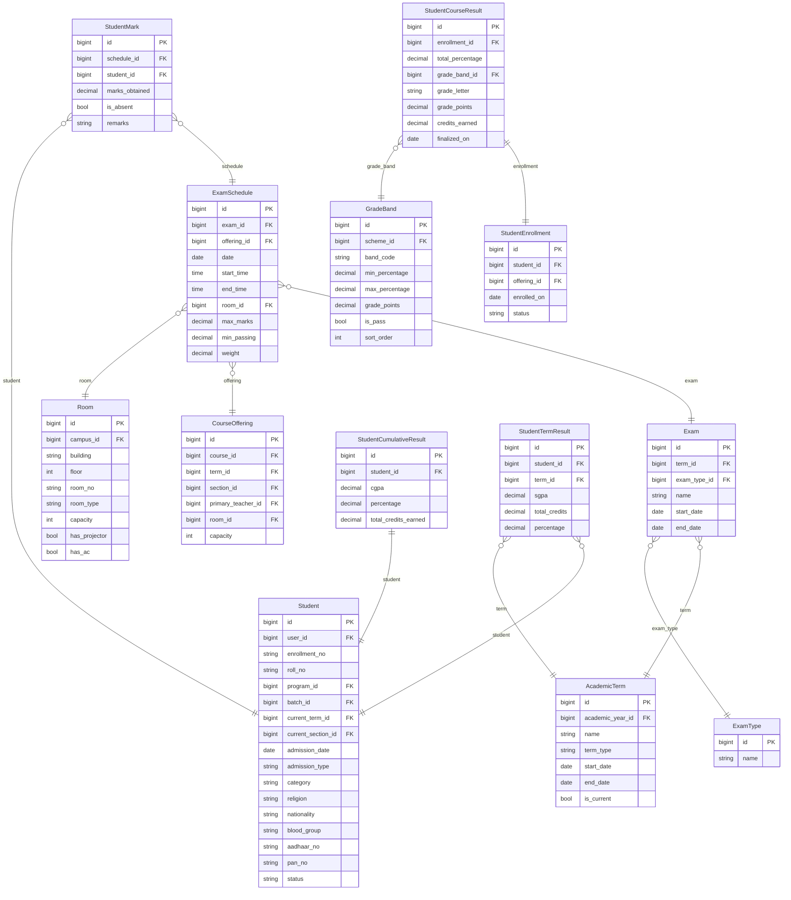
```mermaid
erDiagram
    AcademicTerm {
        bigint id PK
        bigint academic_year_id FK
        string name
        string term_type
        date start_date
        date end_date
        bool is_current
    }
    CourseOffering {
        bigint id PK
        bigint course_id FK
        bigint term_id FK
        bigint section_id FK
        bigint primary_teacher_id FK
        bigint room_id FK
        int capacity
    }
    Exam {
        bigint id PK
        bigint term_id FK
        bigint exam_type_id FK
        string name
        date start_date
        date end_date
    }
    ExamSchedule {
        bigint id PK
        bigint exam_id FK
        bigint offering_id FK
        date date
        time start_time
        time end_time
        bigint room_id FK
        decimal max_marks
        decimal min_passing
        decimal weight
    }
    ExamType {
        bigint id PK
        string name
    }
    GradeBand {
        bigint id PK
        bigint scheme_id FK
        string band_code
        decimal min_percentage
        decimal max_percentage
        decimal grade_points
        bool is_pass
        int sort_order
    }
    Room {
        bigint id PK
        bigint campus_id FK
        string building
        int floor
        string room_no
        string room_type
        int capacity
        bool has_projector
        bool has_ac
    }
    Student {
        bigint id PK
        bigint user_id FK
        string enrollment_no
        string roll_no
        bigint program_id FK
        bigint batch_id FK
        bigint current_term_id FK
        bigint current_section_id FK
        date admission_date
        string admission_type
        string category
        string religion
        string nationality
        string blood_group
        string aadhaar_no
        string pan_no
        string status
    }
    StudentCourseResult {
        bigint id PK
        bigint enrollment_id FK
        decimal total_percentage
        bigint grade_band_id FK
        string grade_letter
        decimal grade_points
        decimal credits_earned
        date finalized_on
    }
    StudentCumulativeResult {
        bigint id PK
        bigint student_id FK
        decimal cgpa
        decimal percentage
        decimal total_credits_earned
    }
    StudentEnrollment {
        bigint id PK
        bigint student_id FK
        bigint offering_id FK
        date enrolled_on
        string status
    }
    StudentMark {
        bigint id PK
        bigint schedule_id FK
        bigint student_id FK
        decimal marks_obtained
        bool is_absent
        string remarks
    }
    StudentTermResult {
        bigint id PK
        bigint student_id FK
        bigint term_id FK
        decimal sgpa
        decimal total_credits
        decimal percentage
    }
    Exam }o--|| AcademicTerm : term
    Exam }o--|| ExamType : exam_type
    ExamSchedule }o--|| Exam : exam
    ExamSchedule }o--|| CourseOffering : offering
    ExamSchedule }o--|| Room : room
    StudentMark }o--|| ExamSchedule : schedule
    StudentMark }o--|| Student : student
    StudentCourseResult ||--|| StudentEnrollment : enrollment
    StudentCourseResult }o--|| GradeBand : grade_band
    StudentTermResult }o--|| Student : student
    StudentTermResult }o--|| AcademicTerm : term
    StudentCumulativeResult ||--|| Student : student
```

### fees

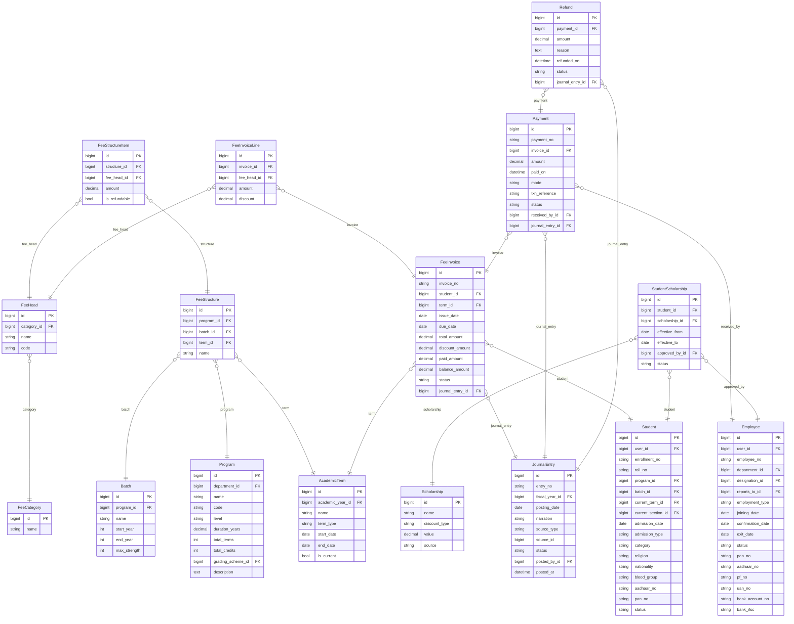
```mermaid
erDiagram
    AcademicTerm {
        bigint id PK
        bigint academic_year_id FK
        string name
        string term_type
        date start_date
        date end_date
        bool is_current
    }
    Batch {
        bigint id PK
        bigint program_id FK
        string name
        int start_year
        int end_year
        int max_strength
    }
    Employee {
        bigint id PK
        bigint user_id FK
        string employee_no
        bigint department_id FK
        bigint designation_id FK
        bigint reports_to_id FK
        string employment_type
        date joining_date
        date confirmation_date
        date exit_date
        string status
        string pan_no
        string aadhaar_no
        string pf_no
        string uan_no
        string bank_account_no
        string bank_ifsc
    }
    FeeCategory {
        bigint id PK
        string name
    }
    FeeHead {
        bigint id PK
        bigint category_id FK
        string name
        string code
    }
    FeeInvoice {
        bigint id PK
        string invoice_no
        bigint student_id FK
        bigint term_id FK
        date issue_date
        date due_date
        decimal total_amount
        decimal discount_amount
        decimal paid_amount
        decimal balance_amount
        string status
        bigint journal_entry_id FK
    }
    FeeInvoiceLine {
        bigint id PK
        bigint invoice_id FK
        bigint fee_head_id FK
        decimal amount
        decimal discount
    }
    FeeStructure {
        bigint id PK
        bigint program_id FK
        bigint batch_id FK
        bigint term_id FK
        string name
    }
    FeeStructureItem {
        bigint id PK
        bigint structure_id FK
        bigint fee_head_id FK
        decimal amount
        bool is_refundable
    }
    JournalEntry {
        bigint id PK
        string entry_no
        bigint fiscal_year_id FK
        date posting_date
        string narration
        string source_type
        bigint source_id
        string status
        bigint posted_by_id FK
        datetime posted_at
    }
    Payment {
        bigint id PK
        string payment_no
        bigint invoice_id FK
        decimal amount
        datetime paid_on
        string mode
        string txn_reference
        string status
        bigint received_by_id FK
        bigint journal_entry_id FK
    }
    Program {
        bigint id PK
        bigint department_id FK
        string name
        string code
        string level
        decimal duration_years
        int total_terms
        int total_credits
        bigint grading_scheme_id FK
        text description
    }
    Refund {
        bigint id PK
        bigint payment_id FK
        decimal amount
        text reason
        datetime refunded_on
        string status
        bigint journal_entry_id FK
    }
    Scholarship {
        bigint id PK
        string name
        string discount_type
        decimal value
        string source
    }
    Student {
        bigint id PK
        bigint user_id FK
        string enrollment_no
        string roll_no
        bigint program_id FK
        bigint batch_id FK
        bigint current_term_id FK
        bigint current_section_id FK
        date admission_date
        string admission_type
        string category
        string religion
        string nationality
        string blood_group
        string aadhaar_no
        string pan_no
        string status
    }
    StudentScholarship {
        bigint id PK
        bigint student_id FK
        bigint scholarship_id FK
        date effective_from
        date effective_to
        bigint approved_by_id FK
        string status
    }
    FeeHead }o--|| FeeCategory : category
    FeeStructure }o--|| Program : program
    FeeStructure }o--|| Batch : batch
    FeeStructure }o--|| AcademicTerm : term
    FeeStructureItem }o--|| FeeStructure : structure
    FeeStructureItem }o--|| FeeHead : fee_head
    FeeInvoice }o--|| Student : student
    FeeInvoice }o--|| AcademicTerm : term
    FeeInvoice }o--|| JournalEntry : journal_entry
    FeeInvoiceLine }o--|| FeeInvoice : invoice
    FeeInvoiceLine }o--|| FeeHead : fee_head
    Payment }o--|| FeeInvoice : invoice
    Payment }o--|| Employee : received_by
    Payment }o--|| JournalEntry : journal_entry
    StudentScholarship }o--|| Student : student
    StudentScholarship }o--|| Scholarship : scholarship
    StudentScholarship }o--|| Employee : approved_by
    Refund }o--|| Payment : payment
    Refund }o--|| JournalEntry : journal_entry
```

### grading

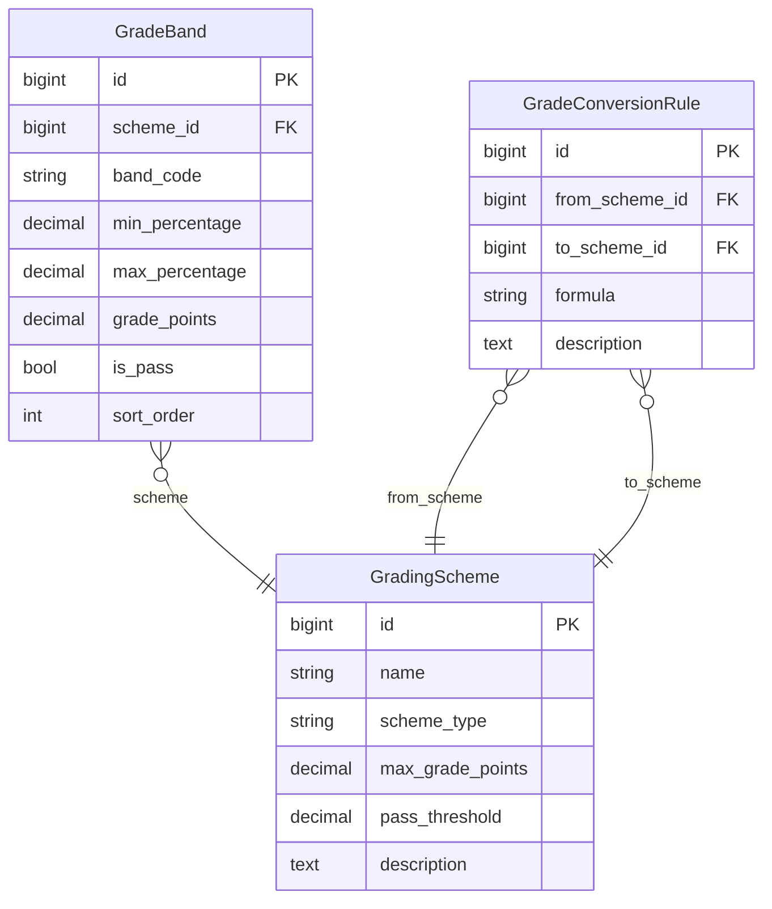
```mermaid
erDiagram
    GradeBand {
        bigint id PK
        bigint scheme_id FK
        string band_code
        decimal min_percentage
        decimal max_percentage
        decimal grade_points
        bool is_pass
        int sort_order
    }
    GradeConversionRule {
        bigint id PK
        bigint from_scheme_id FK
        bigint to_scheme_id FK
        string formula
        text description
    }
    GradingScheme {
        bigint id PK
        string name
        string scheme_type
        decimal max_grade_points
        decimal pass_threshold
        text description
    }
    GradeBand }o--|| GradingScheme : scheme
    GradeConversionRule }o--|| GradingScheme : from_scheme
    GradeConversionRule }o--|| GradingScheme : to_scheme
```

### hostel

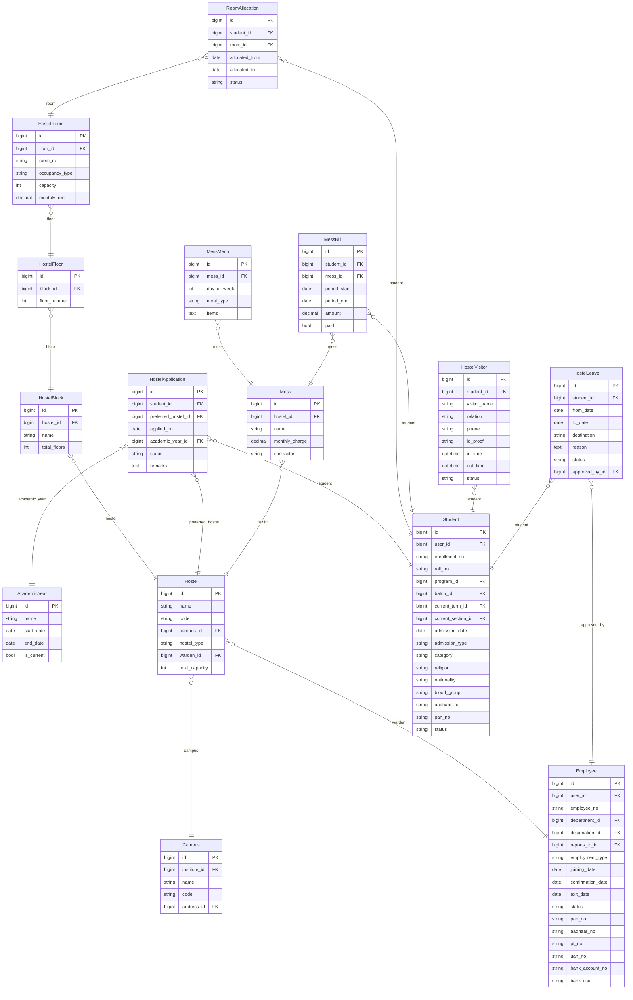
```mermaid
erDiagram
    AcademicYear {
        bigint id PK
        string name
        date start_date
        date end_date
        bool is_current
    }
    Campus {
        bigint id PK
        bigint institute_id FK
        string name
        string code
        bigint address_id FK
    }
    Employee {
        bigint id PK
        bigint user_id FK
        string employee_no
        bigint department_id FK
        bigint designation_id FK
        bigint reports_to_id FK
        string employment_type
        date joining_date
        date confirmation_date
        date exit_date
        string status
        string pan_no
        string aadhaar_no
        string pf_no
        string uan_no
        string bank_account_no
        string bank_ifsc
    }
    Hostel {
        bigint id PK
        string name
        string code
        bigint campus_id FK
        string hostel_type
        bigint warden_id FK
        int total_capacity
    }
    HostelApplication {
        bigint id PK
        bigint student_id FK
        bigint preferred_hostel_id FK
        date applied_on
        bigint academic_year_id FK
        string status
        text remarks
    }
    HostelBlock {
        bigint id PK
        bigint hostel_id FK
        string name
        int total_floors
    }
    HostelFloor {
        bigint id PK
        bigint block_id FK
        int floor_number
    }
    HostelLeave {
        bigint id PK
        bigint student_id FK
        date from_date
        date to_date
        string destination
        text reason
        string status
        bigint approved_by_id FK
    }
    HostelRoom {
        bigint id PK
        bigint floor_id FK
        string room_no
        string occupancy_type
        int capacity
        decimal monthly_rent
    }
    HostelVisitor {
        bigint id PK
        bigint student_id FK
        string visitor_name
        string relation
        string phone
        string id_proof
        datetime in_time
        datetime out_time
        string status
    }
    Mess {
        bigint id PK
        bigint hostel_id FK
        string name
        decimal monthly_charge
        string contractor
    }
    MessBill {
        bigint id PK
        bigint student_id FK
        bigint mess_id FK
        date period_start
        date period_end
        decimal amount
        bool paid
    }
    MessMenu {
        bigint id PK
        bigint mess_id FK
        int day_of_week
        string meal_type
        text items
    }
    RoomAllocation {
        bigint id PK
        bigint student_id FK
        bigint room_id FK
        date allocated_from
        date allocated_to
        string status
    }
    Student {
        bigint id PK
        bigint user_id FK
        string enrollment_no
        string roll_no
        bigint program_id FK
        bigint batch_id FK
        bigint current_term_id FK
        bigint current_section_id FK
        date admission_date
        string admission_type
        string category
        string religion
        string nationality
        string blood_group
        string aadhaar_no
        string pan_no
        string status
    }
    Hostel }o--|| Campus : campus
    Hostel }o--|| Employee : warden
    HostelBlock }o--|| Hostel : hostel
    HostelFloor }o--|| HostelBlock : block
    HostelRoom }o--|| HostelFloor : floor
    HostelApplication }o--|| Student : student
    HostelApplication }o--|| Hostel : preferred_hostel
    HostelApplication }o--|| AcademicYear : academic_year
    RoomAllocation }o--|| Student : student
    RoomAllocation }o--|| HostelRoom : room
    Mess }o--|| Hostel : hostel
    MessMenu }o--|| Mess : mess
    MessBill }o--|| Student : student
    MessBill }o--|| Mess : mess
    HostelVisitor }o--|| Student : student
    HostelLeave }o--|| Student : student
    HostelLeave }o--|| Employee : approved_by
```

### leaves

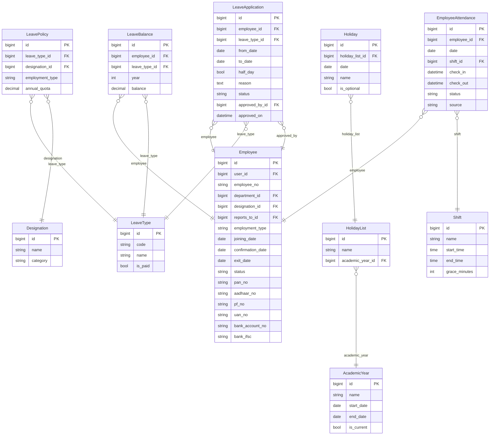
```mermaid
erDiagram
    AcademicYear {
        bigint id PK
        string name
        date start_date
        date end_date
        bool is_current
    }
    Designation {
        bigint id PK
        string name
        string category
    }
    Employee {
        bigint id PK
        bigint user_id FK
        string employee_no
        bigint department_id FK
        bigint designation_id FK
        bigint reports_to_id FK
        string employment_type
        date joining_date
        date confirmation_date
        date exit_date
        string status
        string pan_no
        string aadhaar_no
        string pf_no
        string uan_no
        string bank_account_no
        string bank_ifsc
    }
    EmployeeAttendance {
        bigint id PK
        bigint employee_id FK
        date date
        bigint shift_id FK
        datetime check_in
        datetime check_out
        string status
        string source
    }
    Holiday {
        bigint id PK
        bigint holiday_list_id FK
        date date
        string name
        bool is_optional
    }
    HolidayList {
        bigint id PK
        string name
        bigint academic_year_id FK
    }
    LeaveApplication {
        bigint id PK
        bigint employee_id FK
        bigint leave_type_id FK
        date from_date
        date to_date
        bool half_day
        text reason
        string status
        bigint approved_by_id FK
        datetime approved_on
    }
    LeaveBalance {
        bigint id PK
        bigint employee_id FK
        bigint leave_type_id FK
        int year
        decimal balance
    }
    LeavePolicy {
        bigint id PK
        bigint leave_type_id FK
        bigint designation_id FK
        string employment_type
        decimal annual_quota
    }
    LeaveType {
        bigint id PK
        string code
        string name
        bool is_paid
    }
    Shift {
        bigint id PK
        string name
        time start_time
        time end_time
        int grace_minutes
    }
    LeavePolicy }o--|| LeaveType : leave_type
    LeavePolicy }o--|| Designation : designation
    LeaveBalance }o--|| Employee : employee
    LeaveBalance }o--|| LeaveType : leave_type
    LeaveApplication }o--|| Employee : employee
    LeaveApplication }o--|| LeaveType : leave_type
    LeaveApplication }o--|| Employee : approved_by
    HolidayList }o--|| AcademicYear : academic_year
    Holiday }o--|| HolidayList : holiday_list
    EmployeeAttendance }o--|| Employee : employee
    EmployeeAttendance }o--|| Shift : shift
```

### library

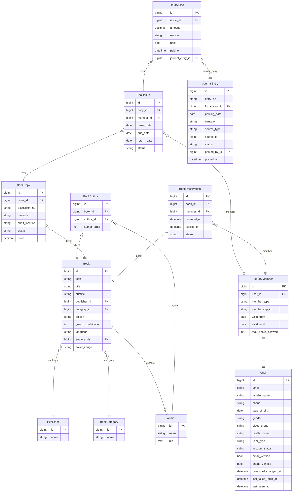
```mermaid
erDiagram
    Author {
        bigint id PK
        string name
        text bio
    }
    Book {
        bigint id PK
        string isbn
        string title
        string subtitle
        bigint publisher_id FK
        bigint category_id FK
        string edition
        int year_of_publication
        string language
        bigint authors_ids FK
        string cover_image
    }
    BookAuthor {
        bigint id PK
        bigint book_id FK
        bigint author_id FK
        int author_order
    }
    BookCategory {
        bigint id PK
        string name
    }
    BookCopy {
        bigint id PK
        bigint book_id FK
        string accession_no
        string barcode
        string shelf_location
        string status
        decimal price
    }
    BookIssue {
        bigint id PK
        bigint copy_id FK
        bigint member_id FK
        date issue_date
        date due_date
        date return_date
        string status
    }
    BookReservation {
        bigint id PK
        bigint book_id FK
        bigint member_id FK
        datetime reserved_on
        datetime fulfilled_on
        string status
    }
    JournalEntry {
        bigint id PK
        string entry_no
        bigint fiscal_year_id FK
        date posting_date
        string narration
        string source_type
        bigint source_id
        string status
        bigint posted_by_id FK
        datetime posted_at
    }
    LibraryFine {
        bigint id PK
        bigint issue_id FK
        decimal amount
        string reason
        bool paid
        datetime paid_on
        bigint journal_entry_id FK
    }
    LibraryMember {
        bigint id PK
        bigint user_id FK
        string member_type
        string membership_id
        date valid_from
        date valid_until
        int max_books_allowed
    }
    Publisher {
        bigint id PK
        string name
    }
    User {
        bigint id PK
        string email
        string middle_name
        string phone
        date date_of_birth
        string gender
        string blood_group
        string profile_photo
        string user_type
        string account_status
        bool email_verified
        bool phone_verified
        datetime password_changed_at
        datetime last_failed_login_at
        datetime last_seen_at
    }
    Book }o--|| Publisher : publisher
    Book }o--|| BookCategory : category
    Book }o--o{ Author : authors
    BookAuthor }o--|| Book : book
    BookAuthor }o--|| Author : author
    BookCopy }o--|| Book : book
    LibraryMember ||--|| User : user
    BookIssue }o--|| BookCopy : copy
    BookIssue }o--|| LibraryMember : member
    BookReservation }o--|| Book : book
    BookReservation }o--|| LibraryMember : member
    LibraryFine }o--|| BookIssue : issue
    LibraryFine }o--|| JournalEntry : journal_entry
```

### lms

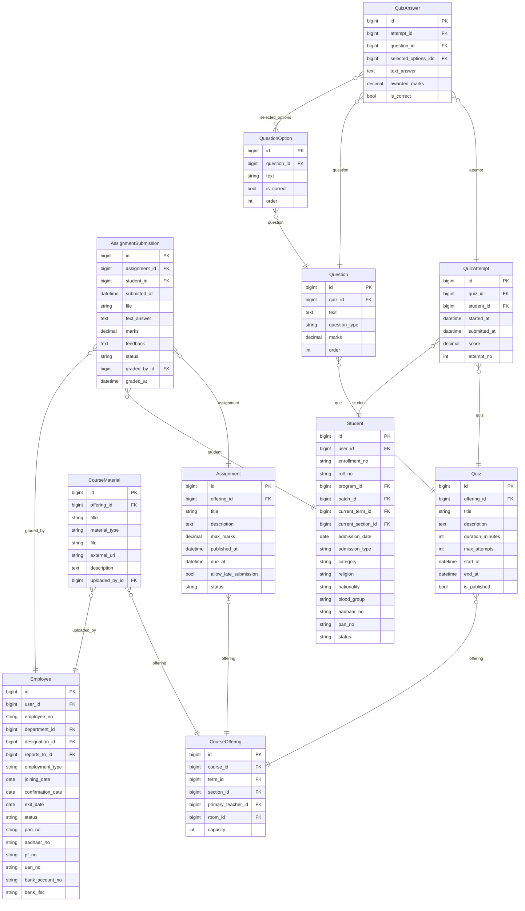
```mermaid
erDiagram
    Assignment {
        bigint id PK
        bigint offering_id FK
        string title
        text description
        decimal max_marks
        datetime published_at
        datetime due_at
        bool allow_late_submission
        string status
    }
    AssignmentSubmission {
        bigint id PK
        bigint assignment_id FK
        bigint student_id FK
        datetime submitted_at
        string file
        text text_answer
        decimal marks
        text feedback
        string status
        bigint graded_by_id FK
        datetime graded_at
    }
    CourseMaterial {
        bigint id PK
        bigint offering_id FK
        string title
        string material_type
        string file
        string external_url
        text description
        bigint uploaded_by_id FK
    }
    CourseOffering {
        bigint id PK
        bigint course_id FK
        bigint term_id FK
        bigint section_id FK
        bigint primary_teacher_id FK
        bigint room_id FK
        int capacity
    }
    Employee {
        bigint id PK
        bigint user_id FK
        string employee_no
        bigint department_id FK
        bigint designation_id FK
        bigint reports_to_id FK
        string employment_type
        date joining_date
        date confirmation_date
        date exit_date
        string status
        string pan_no
        string aadhaar_no
        string pf_no
        string uan_no
        string bank_account_no
        string bank_ifsc
    }
    Question {
        bigint id PK
        bigint quiz_id FK
        text text
        string question_type
        decimal marks
        int order
    }
    QuestionOption {
        bigint id PK
        bigint question_id FK
        string text
        bool is_correct
        int order
    }
    Quiz {
        bigint id PK
        bigint offering_id FK
        string title
        text description
        int duration_minutes
        int max_attempts
        datetime start_at
        datetime end_at
        bool is_published
    }
    QuizAnswer {
        bigint id PK
        bigint attempt_id FK
        bigint question_id FK
        bigint selected_options_ids FK
        text text_answer
        decimal awarded_marks
        bool is_correct
    }
    QuizAttempt {
        bigint id PK
        bigint quiz_id FK
        bigint student_id FK
        datetime started_at
        datetime submitted_at
        decimal score
        int attempt_no
    }
    Student {
        bigint id PK
        bigint user_id FK
        string enrollment_no
        string roll_no
        bigint program_id FK
        bigint batch_id FK
        bigint current_term_id FK
        bigint current_section_id FK
        date admission_date
        string admission_type
        string category
        string religion
        string nationality
        string blood_group
        string aadhaar_no
        string pan_no
        string status
    }
    CourseMaterial }o--|| CourseOffering : offering
    CourseMaterial }o--|| Employee : uploaded_by
    Assignment }o--|| CourseOffering : offering
    AssignmentSubmission }o--|| Assignment : assignment
    AssignmentSubmission }o--|| Student : student
    AssignmentSubmission }o--|| Employee : graded_by
    Quiz }o--|| CourseOffering : offering
    Question }o--|| Quiz : quiz
    QuestionOption }o--|| Question : question
    QuizAttempt }o--|| Quiz : quiz
    QuizAttempt }o--|| Student : student
    QuizAnswer }o--|| QuizAttempt : attempt
    QuizAnswer }o--|| Question : question
    QuizAnswer }o--o{ QuestionOption : selected_options
```

### organization

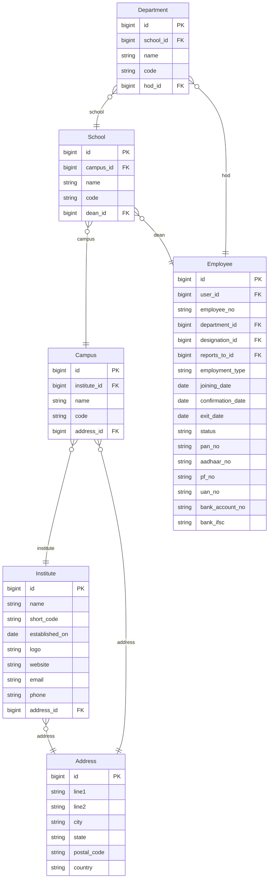
```mermaid
erDiagram
    Address {
        bigint id PK
        string line1
        string line2
        string city
        string state
        string postal_code
        string country
    }
    Campus {
        bigint id PK
        bigint institute_id FK
        string name
        string code
        bigint address_id FK
    }
    Department {
        bigint id PK
        bigint school_id FK
        string name
        string code
        bigint hod_id FK
    }
    Employee {
        bigint id PK
        bigint user_id FK
        string employee_no
        bigint department_id FK
        bigint designation_id FK
        bigint reports_to_id FK
        string employment_type
        date joining_date
        date confirmation_date
        date exit_date
        string status
        string pan_no
        string aadhaar_no
        string pf_no
        string uan_no
        string bank_account_no
        string bank_ifsc
    }
    Institute {
        bigint id PK
        string name
        string short_code
        date established_on
        string logo
        string website
        string email
        string phone
        bigint address_id FK
    }
    School {
        bigint id PK
        bigint campus_id FK
        string name
        string code
        bigint dean_id FK
    }
    Institute }o--|| Address : address
    Campus }o--|| Institute : institute
    Campus }o--|| Address : address
    School }o--|| Campus : campus
    School }o--|| Employee : dean
    Department }o--|| School : school
    Department }o--|| Employee : hod
```

### payroll

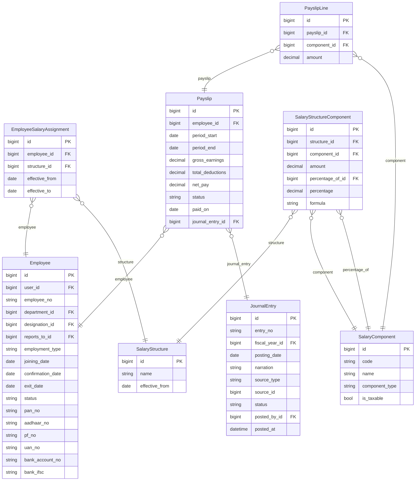
```mermaid
erDiagram
    Employee {
        bigint id PK
        bigint user_id FK
        string employee_no
        bigint department_id FK
        bigint designation_id FK
        bigint reports_to_id FK
        string employment_type
        date joining_date
        date confirmation_date
        date exit_date
        string status
        string pan_no
        string aadhaar_no
        string pf_no
        string uan_no
        string bank_account_no
        string bank_ifsc
    }
    EmployeeSalaryAssignment {
        bigint id PK
        bigint employee_id FK
        bigint structure_id FK
        date effective_from
        date effective_to
    }
    JournalEntry {
        bigint id PK
        string entry_no
        bigint fiscal_year_id FK
        date posting_date
        string narration
        string source_type
        bigint source_id
        string status
        bigint posted_by_id FK
        datetime posted_at
    }
    Payslip {
        bigint id PK
        bigint employee_id FK
        date period_start
        date period_end
        decimal gross_earnings
        decimal total_deductions
        decimal net_pay
        string status
        date paid_on
        bigint journal_entry_id FK
    }
    PayslipLine {
        bigint id PK
        bigint payslip_id FK
        bigint component_id FK
        decimal amount
    }
    SalaryComponent {
        bigint id PK
        string code
        string name
        string component_type
        bool is_taxable
    }
    SalaryStructure {
        bigint id PK
        string name
        date effective_from
    }
    SalaryStructureComponent {
        bigint id PK
        bigint structure_id FK
        bigint component_id FK
        decimal amount
        bigint percentage_of_id FK
        decimal percentage
        string formula
    }
    SalaryStructureComponent }o--|| SalaryStructure : structure
    SalaryStructureComponent }o--|| SalaryComponent : component
    SalaryStructureComponent }o--|| SalaryComponent : percentage_of
    EmployeeSalaryAssignment }o--|| Employee : employee
    EmployeeSalaryAssignment }o--|| SalaryStructure : structure
    Payslip }o--|| Employee : employee
    Payslip }o--|| JournalEntry : journal_entry
    PayslipLine }o--|| Payslip : payslip
    PayslipLine }o--|| SalaryComponent : component
```

### placements

```mermaid
erDiagram
    AcademicYear {
        bigint id PK
        string name
        date start_date
        date end_date
        bool is_current
    }
    Company {
        bigint id PK
        string name
        string website
        string industry
        string hq_location
        string contact_name
        string contact_email
        string contact_phone
    }
    JobPosting {
        bigint id PK
        bigint drive_id FK
        string title
        text description
        string role_type
        decimal ctc
        decimal stipend
        string location
        decimal min_cgpa
        bigint eligible_programs_ids FK
        date apply_by
    }
    PlacementApplication {
        bigint id PK
        bigint posting_id FK
        bigint student_id FK
        datetime applied_on
        string resume
        string status
    }
    PlacementDrive {
        bigint id PK
        bigint company_id FK
        bigint academic_year_id FK
        string name
        date start_date
        date end_date
        text eligibility_criteria
    }
    PlacementInterviewResult {
        bigint id PK
        bigint application_id FK
        bigint round_id FK
        string result
        text remarks
    }
    PlacementInterviewRound {
        bigint id PK
        bigint posting_id FK
        int round_no
        string name
        datetime scheduled_at
    }
    PlacementOffer {
        bigint id PK
        bigint application_id FK
        date offered_on
        decimal ctc
        date joining_date
        string offer_letter
        string status
    }
    Program {
        bigint id PK
        bigint department_id FK
        string name
        string code
        string level
        decimal duration_years
        int total_terms
        int total_credits
        bigint grading_scheme_id FK
        text description
    }
    Student {
        bigint id PK
        bigint user_id FK
        string enrollment_no
        string roll_no
        bigint program_id FK
        bigint batch_id FK
        bigint current_term_id FK
        bigint current_section_id FK
        date admission_date
        string admission_type
        string category
        string religion
        string nationality
        string blood_group
        string aadhaar_no
        string pan_no
        string status
    }
    PlacementDrive }o--|| Company : company
    PlacementDrive }o--|| AcademicYear : academic_year
    JobPosting }o--|| PlacementDrive : drive
    JobPosting }o--o{ Program : eligible_programs
    PlacementApplication }o--|| JobPosting : posting
    PlacementApplication }o--|| Student : student
    PlacementInterviewRound }o--|| JobPosting : posting
    PlacementInterviewResult }o--|| PlacementApplication : application
    PlacementInterviewResult }o--|| PlacementInterviewRound : round
    PlacementOffer ||--|| PlacementApplication : application
```

### recruitment

```mermaid
erDiagram
    Department {
        bigint id PK
        bigint school_id FK
        string name
        string code
        bigint hod_id FK
    }
    Designation {
        bigint id PK
        string name
        string category
    }
    Employee {
        bigint id PK
        bigint user_id FK
        string employee_no
        bigint department_id FK
        bigint designation_id FK
        bigint reports_to_id FK
        string employment_type
        date joining_date
        date confirmation_date
        date exit_date
        string status
        string pan_no
        string aadhaar_no
        string pf_no
        string uan_no
        string bank_account_no
        string bank_ifsc
    }
    JobApplicant {
        bigint id PK
        bigint opening_id FK
        string first_name
        string last_name
        string email
        string phone
        string resume
        decimal years_of_experience
        decimal current_ctc
        decimal expected_ctc
        date applied_on
        string status
    }
    JobOpening {
        bigint id PK
        string title
        bigint department_id FK
        bigint designation_id FK
        text description
        int vacancies
        decimal min_experience_years
        date opened_on
        date closing_on
        string status
    }
    RecruitmentInterview {
        bigint id PK
        bigint applicant_id FK
        int round_no
        datetime scheduled_at
        bigint interviewer_id FK
        text feedback
        int rating
        string result
    }
    RecruitmentOffer {
        bigint id PK
        bigint applicant_id FK
        date offered_on
        decimal ctc
        date joining_date
        string offer_letter
        string status
    }
    JobOpening }o--|| Department : department
    JobOpening }o--|| Designation : designation
    JobApplicant }o--|| JobOpening : opening
    RecruitmentInterview }o--|| JobApplicant : applicant
    RecruitmentInterview }o--|| Employee : interviewer
    RecruitmentOffer ||--|| JobApplicant : applicant
```

### student_attendance

```mermaid
erDiagram
    AttendanceSession {
        bigint id PK
        bigint offering_id FK
        date date
        time start_time
        time end_time
        bigint room_id FK
        bigint taken_by_id FK
    }
    CourseOffering {
        bigint id PK
        bigint course_id FK
        bigint term_id FK
        bigint section_id FK
        bigint primary_teacher_id FK
        bigint room_id FK
        int capacity
    }
    Employee {
        bigint id PK
        bigint user_id FK
        string employee_no
        bigint department_id FK
        bigint designation_id FK
        bigint reports_to_id FK
        string employment_type
        date joining_date
        date confirmation_date
        date exit_date
        string status
        string pan_no
        string aadhaar_no
        string pf_no
        string uan_no
        string bank_account_no
        string bank_ifsc
    }
    Room {
        bigint id PK
        bigint campus_id FK
        string building
        int floor
        string room_no
        string room_type
        int capacity
        bool has_projector
        bool has_ac
    }
    Student {
        bigint id PK
        bigint user_id FK
        string enrollment_no
        string roll_no
        bigint program_id FK
        bigint batch_id FK
        bigint current_term_id FK
        bigint current_section_id FK
        date admission_date
        string admission_type
        string category
        string religion
        string nationality
        string blood_group
        string aadhaar_no
        string pan_no
        string status
    }
    StudentAttendance {
        bigint id PK
        bigint session_id FK
        bigint student_id FK
        string status
        string remarks
    }
    AttendanceSession }o--|| CourseOffering : offering
    AttendanceSession }o--|| Room : room
    AttendanceSession }o--|| Employee : taken_by
    StudentAttendance }o--|| AttendanceSession : session
    StudentAttendance }o--|| Student : student
```

### students

```mermaid
erDiagram
    AcademicTerm {
        bigint id PK
        bigint academic_year_id FK
        string name
        string term_type
        date start_date
        date end_date
        bool is_current
    }
    Address {
        bigint id PK
        string line1
        string line2
        string city
        string state
        string postal_code
        string country
    }
    Application {
        bigint id PK
        string application_no
        bigint program_id FK
        string first_name
        string last_name
        string email
        string phone
        date date_of_birth
        string gender
        string previous_qualification
        decimal previous_percentage
        string entrance_exam
        decimal entrance_score
        string status
        date applied_on
        date decision_on
    }
    Batch {
        bigint id PK
        bigint program_id FK
        string name
        int start_year
        int end_year
        int max_strength
    }
    CourseOffering {
        bigint id PK
        bigint course_id FK
        bigint term_id FK
        bigint section_id FK
        bigint primary_teacher_id FK
        bigint room_id FK
        int capacity
    }
    Guardian {
        bigint id PK
        bigint user_id FK
        string name
        string relation
        string occupation
        decimal annual_income
        string phone
        string email
        bigint address_id FK
    }
    Program {
        bigint id PK
        bigint department_id FK
        string name
        string code
        string level
        decimal duration_years
        int total_terms
        int total_credits
        bigint grading_scheme_id FK
        text description
    }
    Section {
        bigint id PK
        bigint batch_id FK
        bigint term_id FK
        string name
        bigint class_teacher_id FK
        int max_strength
    }
    Student {
        bigint id PK
        bigint user_id FK
        string enrollment_no
        string roll_no
        bigint program_id FK
        bigint batch_id FK
        bigint current_term_id FK
        bigint current_section_id FK
        date admission_date
        string admission_type
        string category
        string religion
        string nationality
        string blood_group
        string aadhaar_no
        string pan_no
        string status
    }
    StudentEnrollment {
        bigint id PK
        bigint student_id FK
        bigint offering_id FK
        date enrolled_on
        string status
    }
    StudentGuardian {
        bigint id PK
        bigint student_id FK
        bigint guardian_id FK
        bool is_primary
    }
    User {
        bigint id PK
        string email
        string middle_name
        string phone
        date date_of_birth
        string gender
        string blood_group
        string profile_photo
        string user_type
        string account_status
        bool email_verified
        bool phone_verified
        datetime password_changed_at
        datetime last_failed_login_at
        datetime last_seen_at
    }
    Application }o--|| Program : program
    Student ||--|| User : user
    Student }o--|| Program : program
    Student }o--|| Batch : batch
    Student }o--|| AcademicTerm : current_term
    Student }o--|| Section : current_section
    Guardian ||--|| User : user
    Guardian }o--|| Address : address
    StudentGuardian }o--|| Student : student
    StudentGuardian }o--|| Guardian : guardian
    StudentEnrollment }o--|| Student : student
    StudentEnrollment }o--|| CourseOffering : offering
```

### timetable

```mermaid
erDiagram
    Campus {
        bigint id PK
        bigint institute_id FK
        string name
        string code
        bigint address_id FK
    }
    CourseOffering {
        bigint id PK
        bigint course_id FK
        bigint term_id FK
        bigint section_id FK
        bigint primary_teacher_id FK
        bigint room_id FK
        int capacity
    }
    Employee {
        bigint id PK
        bigint user_id FK
        string employee_no
        bigint department_id FK
        bigint designation_id FK
        bigint reports_to_id FK
        string employment_type
        date joining_date
        date confirmation_date
        date exit_date
        string status
        string pan_no
        string aadhaar_no
        string pf_no
        string uan_no
        string bank_account_no
        string bank_ifsc
    }
    Room {
        bigint id PK
        bigint campus_id FK
        string building
        int floor
        string room_no
        string room_type
        int capacity
        bool has_projector
        bool has_ac
    }
    Section {
        bigint id PK
        bigint batch_id FK
        bigint term_id FK
        string name
        bigint class_teacher_id FK
        int max_strength
    }
    TimeSlot {
        bigint id PK
        int day_of_week
        time start_time
        time end_time
        string name
    }
    TimetableEntry {
        bigint id PK
        bigint section_id FK
        bigint offering_id FK
        bigint time_slot_id FK
        bigint teacher_id FK
        bigint room_id FK
        date effective_from
        date effective_to
    }
    Room }o--|| Campus : campus
    TimetableEntry }o--|| Section : section
    TimetableEntry }o--|| CourseOffering : offering
    TimetableEntry }o--|| TimeSlot : time_slot
    TimetableEntry }o--|| Employee : teacher
    TimetableEntry }o--|| Room : room
```

## Model Catalogue

| App | Model | Fields / relationships |
|---|---|---|
| `academic` | `AcademicTerm` | bigint academic_year_id FK, string name, string term_type, date start_date, date end_date, bool is_current |
| `academic` | `AcademicYear` | string name, date start_date, date end_date, bool is_current |
| `academic` | `Batch` | bigint program_id FK, string name, int start_year, int end_year, int max_strength |
| `academic` | `Program` | bigint department_id FK, string name, string code, string level, decimal duration_years, int total_terms, int total_credits, bigint grading_scheme_id FK, text description |
| `academic` | `Section` | bigint batch_id FK, bigint term_id FK, string name, bigint class_teacher_id FK, int max_strength |
| `accounting` | `AccountGroup` | string name, string code, bigint parent_id FK, string root_type |
| `accounting` | `ChartOfAccount` | string code, string name, bigint group_id FK, string account_type, bigint currency_id FK, bool is_bank, decimal opening_balance |
| `accounting` | `FiscalYear` | string name, date start_date, date end_date, bool is_closed |
| `accounting` | `JournalEntry` | string entry_no, bigint fiscal_year_id FK, date posting_date, string narration, string source_type, bigint source_id, string status, bigint posted_by_id FK, datetime posted_at |
| `accounting` | `JournalLine` | bigint entry_id FK, bigint account_id FK, decimal debit, decimal credit, bigint party_content_type_id FK, bigint party_id, string party, string description |
| `alumni` | `Alumni` | bigint user_id FK, bigint student_id FK, bigint program_id FK, bigint batch_id FK, int graduation_year, string current_company, string current_role, string linkedin_url, string location, text bio |
| `alumni` | `AlumniDonation` | bigint alumni_id FK, decimal amount, string purpose, date donated_on, string payment_mode, string txn_reference, bigint journal_entry_id FK |
| `alumni` | `AlumniEvent` | string title, string event_type, text description, datetime start_at, datetime end_at, string venue, bool is_online, string meeting_link |
| `alumni` | `AlumniEventAttendee` | bigint event_id FK, bigint alumni_id FK, datetime registered_on, bool attended |
| `assets` | `Asset` | string asset_tag, string name, bigint category_id FK, bigint vendor_id FK, date purchase_date, decimal purchase_cost, string serial_no, string location, string condition, date warranty_until |
| `assets` | `AssetAssignment` | bigint asset_id FK, bigint assigned_content_type_id FK, bigint assigned_object_id, string assigned_to, date assigned_on, date returned_on, string remarks |
| `assets` | `AssetCategory` | string name, decimal depreciation_percent |
| `assets` | `Purchase` | string po_no, bigint vendor_id FK, date purchase_date, decimal total_amount, string status, bigint journal_entry_id FK |
| `assets` | `PurchaseItem` | bigint purchase_id FK, string description, int quantity, decimal unit_price, bigint asset_id FK |
| `assets` | `Vendor` | string name, string gst_no, string contact_name, string contact_email, string contact_phone, text address |
| `audit` | `AuditLog` | datetime timestamp, bigint actor_id FK, string action, bigint target_content_type_id FK, bigint target_id, string target, json changes, string user_agent |
| `audit` | `Setting` | string key, json value, text description |
| `communication` | `Announcement` | string title, text body, string audience, bigint department_id FK, bigint program_id FK, bigint batch_id FK, bigint author_id FK, datetime published_at, datetime expires_at |
| `communication` | `Event` | string title, text description, datetime start_at, datetime end_at, string venue, string organized_by |
| `communication` | `Notification` | bigint recipient_id FK, string title, text body, string channel, string status, datetime sent_at, datetime read_at, string url |
| `core` | `Address` | string line1, string line2, string city, string state, string postal_code, string country |
| `core` | `Currency` | string code, string name, string symbol, bool is_default |
| `core` | `Document` | bigint content_type_id FK, bigint object_id, string owner, string name, string doc_type, string file, bigint uploaded_by_id FK, bool verified, string mime_type, bigint file_size, datetime verified_at, bigint verified_by_id FK, bool is_private |
| `core` | `EmergencyContact` | bigint content_type_id FK, bigint object_id, string owner, string name, string relation, string phone, string email, bigint address_id FK, bool phone_verified |
| `core` | `Role` | string code, string name, text description |
| `core` | `User` | string email, string middle_name, string phone, date date_of_birth, string gender, string blood_group, string profile_photo, string user_type, string account_status, bool email_verified, bool phone_verified, datetime password_changed_at, datetime last_failed_login_at, datetime last_seen_at |
| `core` | `UserAddress` | bigint user_id FK, bigint address_id FK, string address_type |
| `core` | `UserRole` | bigint user_id FK, bigint role_id FK, datetime assigned_at, bigint assigned_by_id FK, datetime revoked_at |
| `courses` | `Course` | bigint department_id FK, string code, string title, decimal credits, string course_type, int theory_hours, int practical_hours, text description, bigint prerequisites_ids FK |
| `courses` | `CourseOffering` | bigint course_id FK, bigint term_id FK, bigint section_id FK, bigint primary_teacher_id FK, bigint room_id FK, int capacity |
| `courses` | `CoursePrerequisite` | bigint course_id FK, bigint prereq_course_id FK |
| `courses` | `ProgramCourse` | bigint program_id FK, bigint course_id FK, int term_number, bool is_mandatory |
| `courses` | `SyllabusTopic` | bigint course_id FK, int unit_number, string title, text description, decimal expected_hours |
| `courses` | `TeachingAssignment` | bigint offering_id FK, bigint employee_id FK, string role |
| `employees` | `Designation` | string name, string category |
| `employees` | `Employee` | bigint user_id FK, string employee_no, bigint department_id FK, bigint designation_id FK, bigint reports_to_id FK, string employment_type, date joining_date, date confirmation_date, date exit_date, string status, string pan_no, string aadhaar_no, string pf_no, string uan_no, string bank_account_no, string bank_ifsc |
| `employees` | `Qualification` | bigint employee_id FK, string degree, string institution, int year, decimal percentage, string specialization |
| `employees` | `WorkExperience` | bigint employee_id FK, string company, string role, date start_date, date end_date, text description |
| `exams` | `Exam` | bigint term_id FK, bigint exam_type_id FK, string name, date start_date, date end_date |
| `exams` | `ExamSchedule` | bigint exam_id FK, bigint offering_id FK, date date, time start_time, time end_time, bigint room_id FK, decimal max_marks, decimal min_passing, decimal weight |
| `exams` | `ExamType` | string name |
| `exams` | `StudentCourseResult` | bigint enrollment_id FK, decimal total_percentage, bigint grade_band_id FK, string grade_letter, decimal grade_points, decimal credits_earned, date finalized_on |
| `exams` | `StudentCumulativeResult` | bigint student_id FK, decimal cgpa, decimal percentage, decimal total_credits_earned |
| `exams` | `StudentMark` | bigint schedule_id FK, bigint student_id FK, decimal marks_obtained, bool is_absent, string remarks |
| `exams` | `StudentTermResult` | bigint student_id FK, bigint term_id FK, decimal sgpa, decimal total_credits, decimal percentage |
| `fees` | `FeeCategory` | string name |
| `fees` | `FeeHead` | bigint category_id FK, string name, string code |
| `fees` | `FeeInvoice` | string invoice_no, bigint student_id FK, bigint term_id FK, date issue_date, date due_date, decimal total_amount, decimal discount_amount, decimal paid_amount, decimal balance_amount, string status, bigint journal_entry_id FK |
| `fees` | `FeeInvoiceLine` | bigint invoice_id FK, bigint fee_head_id FK, decimal amount, decimal discount |
| `fees` | `FeeStructure` | bigint program_id FK, bigint batch_id FK, bigint term_id FK, string name |
| `fees` | `FeeStructureItem` | bigint structure_id FK, bigint fee_head_id FK, decimal amount, bool is_refundable |
| `fees` | `Payment` | string payment_no, bigint invoice_id FK, decimal amount, datetime paid_on, string mode, string txn_reference, string status, bigint received_by_id FK, bigint journal_entry_id FK |
| `fees` | `Refund` | bigint payment_id FK, decimal amount, text reason, datetime refunded_on, string status, bigint journal_entry_id FK |
| `fees` | `Scholarship` | string name, string discount_type, decimal value, string source |
| `fees` | `StudentScholarship` | bigint student_id FK, bigint scholarship_id FK, date effective_from, date effective_to, bigint approved_by_id FK, string status |
| `grading` | `GradeBand` | bigint scheme_id FK, string band_code, decimal min_percentage, decimal max_percentage, decimal grade_points, bool is_pass, int sort_order |
| `grading` | `GradeConversionRule` | bigint from_scheme_id FK, bigint to_scheme_id FK, string formula, text description |
| `grading` | `GradingScheme` | string name, string scheme_type, decimal max_grade_points, decimal pass_threshold, text description |
| `hostel` | `Hostel` | string name, string code, bigint campus_id FK, string hostel_type, bigint warden_id FK, int total_capacity |
| `hostel` | `HostelApplication` | bigint student_id FK, bigint preferred_hostel_id FK, date applied_on, bigint academic_year_id FK, string status, text remarks |
| `hostel` | `HostelBlock` | bigint hostel_id FK, string name, int total_floors |
| `hostel` | `HostelFloor` | bigint block_id FK, int floor_number |
| `hostel` | `HostelLeave` | bigint student_id FK, date from_date, date to_date, string destination, text reason, string status, bigint approved_by_id FK |
| `hostel` | `HostelRoom` | bigint floor_id FK, string room_no, string occupancy_type, int capacity, decimal monthly_rent |
| `hostel` | `HostelVisitor` | bigint student_id FK, string visitor_name, string relation, string phone, string id_proof, datetime in_time, datetime out_time, string status |
| `hostel` | `Mess` | bigint hostel_id FK, string name, decimal monthly_charge, string contractor |
| `hostel` | `MessBill` | bigint student_id FK, bigint mess_id FK, date period_start, date period_end, decimal amount, bool paid |
| `hostel` | `MessMenu` | bigint mess_id FK, int day_of_week, string meal_type, text items |
| `hostel` | `RoomAllocation` | bigint student_id FK, bigint room_id FK, date allocated_from, date allocated_to, string status |
| `leaves` | `EmployeeAttendance` | bigint employee_id FK, date date, bigint shift_id FK, datetime check_in, datetime check_out, string status, string source |
| `leaves` | `Holiday` | bigint holiday_list_id FK, date date, string name, bool is_optional |
| `leaves` | `HolidayList` | string name, bigint academic_year_id FK |
| `leaves` | `LeaveApplication` | bigint employee_id FK, bigint leave_type_id FK, date from_date, date to_date, bool half_day, text reason, string status, bigint approved_by_id FK, datetime approved_on |
| `leaves` | `LeaveBalance` | bigint employee_id FK, bigint leave_type_id FK, int year, decimal balance |
| `leaves` | `LeavePolicy` | bigint leave_type_id FK, bigint designation_id FK, string employment_type, decimal annual_quota |
| `leaves` | `LeaveType` | string code, string name, bool is_paid |
| `leaves` | `Shift` | string name, time start_time, time end_time, int grace_minutes |
| `library` | `Author` | string name, text bio |
| `library` | `Book` | string isbn, string title, string subtitle, bigint publisher_id FK, bigint category_id FK, string edition, int year_of_publication, string language, bigint authors_ids FK, string cover_image |
| `library` | `BookAuthor` | bigint book_id FK, bigint author_id FK, int author_order |
| `library` | `BookCategory` | string name |
| `library` | `BookCopy` | bigint book_id FK, string accession_no, string barcode, string shelf_location, string status, decimal price |
| `library` | `BookIssue` | bigint copy_id FK, bigint member_id FK, date issue_date, date due_date, date return_date, string status |
| `library` | `BookReservation` | bigint book_id FK, bigint member_id FK, datetime reserved_on, datetime fulfilled_on, string status |
| `library` | `LibraryFine` | bigint issue_id FK, decimal amount, string reason, bool paid, datetime paid_on, bigint journal_entry_id FK |
| `library` | `LibraryMember` | bigint user_id FK, string member_type, string membership_id, date valid_from, date valid_until, int max_books_allowed |
| `library` | `Publisher` | string name |
| `lms` | `Assignment` | bigint offering_id FK, string title, text description, decimal max_marks, datetime published_at, datetime due_at, bool allow_late_submission, string status |
| `lms` | `AssignmentSubmission` | bigint assignment_id FK, bigint student_id FK, datetime submitted_at, string file, text text_answer, decimal marks, text feedback, string status, bigint graded_by_id FK, datetime graded_at |
| `lms` | `CourseMaterial` | bigint offering_id FK, string title, string material_type, string file, string external_url, text description, bigint uploaded_by_id FK |
| `lms` | `Question` | bigint quiz_id FK, text text, string question_type, decimal marks, int order |
| `lms` | `QuestionOption` | bigint question_id FK, string text, bool is_correct, int order |
| `lms` | `Quiz` | bigint offering_id FK, string title, text description, int duration_minutes, int max_attempts, datetime start_at, datetime end_at, bool is_published |
| `lms` | `QuizAnswer` | bigint attempt_id FK, bigint question_id FK, bigint selected_options_ids FK, text text_answer, decimal awarded_marks, bool is_correct |
| `lms` | `QuizAttempt` | bigint quiz_id FK, bigint student_id FK, datetime started_at, datetime submitted_at, decimal score, int attempt_no |
| `organization` | `Campus` | bigint institute_id FK, string name, string code, bigint address_id FK |
| `organization` | `Department` | bigint school_id FK, string name, string code, bigint hod_id FK |
| `organization` | `Institute` | string name, string short_code, date established_on, string logo, string website, string email, string phone, bigint address_id FK |
| `organization` | `School` | bigint campus_id FK, string name, string code, bigint dean_id FK |
| `payroll` | `EmployeeSalaryAssignment` | bigint employee_id FK, bigint structure_id FK, date effective_from, date effective_to |
| `payroll` | `Payslip` | bigint employee_id FK, date period_start, date period_end, decimal gross_earnings, decimal total_deductions, decimal net_pay, string status, date paid_on, bigint journal_entry_id FK |
| `payroll` | `PayslipLine` | bigint payslip_id FK, bigint component_id FK, decimal amount |
| `payroll` | `SalaryComponent` | string code, string name, string component_type, bool is_taxable |
| `payroll` | `SalaryStructure` | string name, date effective_from |
| `payroll` | `SalaryStructureComponent` | bigint structure_id FK, bigint component_id FK, decimal amount, bigint percentage_of_id FK, decimal percentage, string formula |
| `placements` | `Company` | string name, string website, string industry, string hq_location, string contact_name, string contact_email, string contact_phone |
| `placements` | `JobPosting` | bigint drive_id FK, string title, text description, string role_type, decimal ctc, decimal stipend, string location, decimal min_cgpa, bigint eligible_programs_ids FK, date apply_by |
| `placements` | `PlacementApplication` | bigint posting_id FK, bigint student_id FK, datetime applied_on, string resume, string status |
| `placements` | `PlacementDrive` | bigint company_id FK, bigint academic_year_id FK, string name, date start_date, date end_date, text eligibility_criteria |
| `placements` | `PlacementInterviewResult` | bigint application_id FK, bigint round_id FK, string result, text remarks |
| `placements` | `PlacementInterviewRound` | bigint posting_id FK, int round_no, string name, datetime scheduled_at |
| `placements` | `PlacementOffer` | bigint application_id FK, date offered_on, decimal ctc, date joining_date, string offer_letter, string status |
| `recruitment` | `JobApplicant` | bigint opening_id FK, string first_name, string last_name, string email, string phone, string resume, decimal years_of_experience, decimal current_ctc, decimal expected_ctc, date applied_on, string status |
| `recruitment` | `JobOpening` | string title, bigint department_id FK, bigint designation_id FK, text description, int vacancies, decimal min_experience_years, date opened_on, date closing_on, string status |
| `recruitment` | `RecruitmentInterview` | bigint applicant_id FK, int round_no, datetime scheduled_at, bigint interviewer_id FK, text feedback, int rating, string result |
| `recruitment` | `RecruitmentOffer` | bigint applicant_id FK, date offered_on, decimal ctc, date joining_date, string offer_letter, string status |
| `student_attendance` | `AttendanceSession` | bigint offering_id FK, date date, time start_time, time end_time, bigint room_id FK, bigint taken_by_id FK |
| `student_attendance` | `StudentAttendance` | bigint session_id FK, bigint student_id FK, string status, string remarks |
| `students` | `Application` | string application_no, bigint program_id FK, string first_name, string last_name, string email, string phone, date date_of_birth, string gender, string previous_qualification, decimal previous_percentage, string entrance_exam, decimal entrance_score, string status, date applied_on, date decision_on |
| `students` | `Guardian` | bigint user_id FK, string name, string relation, string occupation, decimal annual_income, string phone, string email, bigint address_id FK |
| `students` | `Student` | bigint user_id FK, string enrollment_no, string roll_no, bigint program_id FK, bigint batch_id FK, bigint current_term_id FK, bigint current_section_id FK, date admission_date, string admission_type, string category, string religion, string nationality, string blood_group, string aadhaar_no, string pan_no, string status |
| `students` | `StudentEnrollment` | bigint student_id FK, bigint offering_id FK, date enrolled_on, string status |
| `students` | `StudentGuardian` | bigint student_id FK, bigint guardian_id FK, bool is_primary |
| `timetable` | `Room` | bigint campus_id FK, string building, int floor, string room_no, string room_type, int capacity, bool has_projector, bool has_ac |
| `timetable` | `TimeSlot` | int day_of_week, time start_time, time end_time, string name |
| `timetable` | `TimetableEntry` | bigint section_id FK, bigint offering_id FK, bigint time_slot_id FK, bigint teacher_id FK, bigint room_id FK, date effective_from, date effective_to |

## Relationship Inventory

| Source | Type | Target | Field |
|---|---|---|---|
| `AcademicTerm` | `FK` | `AcademicYear` | `academic_year` |
| `Program` | `FK` | `Department` | `department` |
| `Program` | `FK` | `GradingScheme` | `grading_scheme` |
| `Batch` | `FK` | `Program` | `program` |
| `Section` | `FK` | `Batch` | `batch` |
| `Section` | `FK` | `AcademicTerm` | `term` |
| `Section` | `FK` | `Employee` | `class_teacher` |
| `AccountGroup` | `FK` | `AccountGroup` | `parent` |
| `ChartOfAccount` | `FK` | `AccountGroup` | `group` |
| `ChartOfAccount` | `FK` | `Currency` | `currency` |
| `JournalEntry` | `FK` | `FiscalYear` | `fiscal_year` |
| `JournalEntry` | `FK` | `User` | `posted_by` |
| `JournalLine` | `FK` | `JournalEntry` | `entry` |
| `JournalLine` | `FK` | `ChartOfAccount` | `account` |
| `JournalLine` | `FK` | `ContentType` | `party_content_type` |
| `Alumni` | `O2O` | `User` | `user` |
| `Alumni` | `O2O` | `Student` | `student` |
| `Alumni` | `FK` | `Program` | `program` |
| `Alumni` | `FK` | `Batch` | `batch` |
| `AlumniEventAttendee` | `FK` | `AlumniEvent` | `event` |
| `AlumniEventAttendee` | `FK` | `Alumni` | `alumni` |
| `AlumniDonation` | `FK` | `Alumni` | `alumni` |
| `AlumniDonation` | `FK` | `JournalEntry` | `journal_entry` |
| `Asset` | `FK` | `AssetCategory` | `category` |
| `Asset` | `FK` | `Vendor` | `vendor` |
| `AssetAssignment` | `FK` | `Asset` | `asset` |
| `AssetAssignment` | `FK` | `ContentType` | `assigned_content_type` |
| `Purchase` | `FK` | `Vendor` | `vendor` |
| `Purchase` | `FK` | `JournalEntry` | `journal_entry` |
| `PurchaseItem` | `FK` | `Purchase` | `purchase` |
| `PurchaseItem` | `FK` | `Asset` | `asset` |
| `AuditLog` | `FK` | `User` | `actor` |
| `AuditLog` | `FK` | `ContentType` | `target_content_type` |
| `Announcement` | `FK` | `Department` | `department` |
| `Announcement` | `FK` | `Program` | `program` |
| `Announcement` | `FK` | `Batch` | `batch` |
| `Announcement` | `FK` | `User` | `author` |
| `Notification` | `FK` | `User` | `recipient` |
| `UserRole` | `FK` | `User` | `user` |
| `UserRole` | `FK` | `Role` | `role` |
| `UserRole` | `FK` | `User` | `assigned_by` |
| `UserAddress` | `FK` | `User` | `user` |
| `UserAddress` | `FK` | `Address` | `address` |
| `Document` | `FK` | `ContentType` | `content_type` |
| `Document` | `FK` | `User` | `uploaded_by` |
| `Document` | `FK` | `User` | `verified_by` |
| `EmergencyContact` | `FK` | `ContentType` | `content_type` |
| `EmergencyContact` | `FK` | `Address` | `address` |
| `Course` | `FK` | `Department` | `department` |
| `Course` | `M2M` | `Course` | `prerequisites` |
| `CoursePrerequisite` | `FK` | `Course` | `course` |
| `CoursePrerequisite` | `FK` | `Course` | `prereq_course` |
| `ProgramCourse` | `FK` | `Program` | `program` |
| `ProgramCourse` | `FK` | `Course` | `course` |
| `CourseOffering` | `FK` | `Course` | `course` |
| `CourseOffering` | `FK` | `AcademicTerm` | `term` |
| `CourseOffering` | `FK` | `Section` | `section` |
| `CourseOffering` | `FK` | `Employee` | `primary_teacher` |
| `CourseOffering` | `FK` | `Room` | `room` |
| `TeachingAssignment` | `FK` | `CourseOffering` | `offering` |
| `TeachingAssignment` | `FK` | `Employee` | `employee` |
| `SyllabusTopic` | `FK` | `Course` | `course` |
| `Employee` | `O2O` | `User` | `user` |
| `Employee` | `FK` | `Department` | `department` |
| `Employee` | `FK` | `Designation` | `designation` |
| `Employee` | `FK` | `Employee` | `reports_to` |
| `Qualification` | `FK` | `Employee` | `employee` |
| `WorkExperience` | `FK` | `Employee` | `employee` |
| `Exam` | `FK` | `AcademicTerm` | `term` |
| `Exam` | `FK` | `ExamType` | `exam_type` |
| `ExamSchedule` | `FK` | `Exam` | `exam` |
| `ExamSchedule` | `FK` | `CourseOffering` | `offering` |
| `ExamSchedule` | `FK` | `Room` | `room` |
| `StudentMark` | `FK` | `ExamSchedule` | `schedule` |
| `StudentMark` | `FK` | `Student` | `student` |
| `StudentCourseResult` | `O2O` | `StudentEnrollment` | `enrollment` |
| `StudentCourseResult` | `FK` | `GradeBand` | `grade_band` |
| `StudentTermResult` | `FK` | `Student` | `student` |
| `StudentTermResult` | `FK` | `AcademicTerm` | `term` |
| `StudentCumulativeResult` | `O2O` | `Student` | `student` |
| `FeeHead` | `FK` | `FeeCategory` | `category` |
| `FeeStructure` | `FK` | `Program` | `program` |
| `FeeStructure` | `FK` | `Batch` | `batch` |
| `FeeStructure` | `FK` | `AcademicTerm` | `term` |
| `FeeStructureItem` | `FK` | `FeeStructure` | `structure` |
| `FeeStructureItem` | `FK` | `FeeHead` | `fee_head` |
| `FeeInvoice` | `FK` | `Student` | `student` |
| `FeeInvoice` | `FK` | `AcademicTerm` | `term` |
| `FeeInvoice` | `FK` | `JournalEntry` | `journal_entry` |
| `FeeInvoiceLine` | `FK` | `FeeInvoice` | `invoice` |
| `FeeInvoiceLine` | `FK` | `FeeHead` | `fee_head` |
| `Payment` | `FK` | `FeeInvoice` | `invoice` |
| `Payment` | `FK` | `Employee` | `received_by` |
| `Payment` | `FK` | `JournalEntry` | `journal_entry` |
| `StudentScholarship` | `FK` | `Student` | `student` |
| `StudentScholarship` | `FK` | `Scholarship` | `scholarship` |
| `StudentScholarship` | `FK` | `Employee` | `approved_by` |
| `Refund` | `FK` | `Payment` | `payment` |
| `Refund` | `FK` | `JournalEntry` | `journal_entry` |
| `GradeBand` | `FK` | `GradingScheme` | `scheme` |
| `GradeConversionRule` | `FK` | `GradingScheme` | `from_scheme` |
| `GradeConversionRule` | `FK` | `GradingScheme` | `to_scheme` |
| `Hostel` | `FK` | `Campus` | `campus` |
| `Hostel` | `FK` | `Employee` | `warden` |
| `HostelBlock` | `FK` | `Hostel` | `hostel` |
| `HostelFloor` | `FK` | `HostelBlock` | `block` |
| `HostelRoom` | `FK` | `HostelFloor` | `floor` |
| `HostelApplication` | `FK` | `Student` | `student` |
| `HostelApplication` | `FK` | `Hostel` | `preferred_hostel` |
| `HostelApplication` | `FK` | `AcademicYear` | `academic_year` |
| `RoomAllocation` | `FK` | `Student` | `student` |
| `RoomAllocation` | `FK` | `HostelRoom` | `room` |
| `Mess` | `FK` | `Hostel` | `hostel` |
| `MessMenu` | `FK` | `Mess` | `mess` |
| `MessBill` | `FK` | `Student` | `student` |
| `MessBill` | `FK` | `Mess` | `mess` |
| `HostelVisitor` | `FK` | `Student` | `student` |
| `HostelLeave` | `FK` | `Student` | `student` |
| `HostelLeave` | `FK` | `Employee` | `approved_by` |
| `LeavePolicy` | `FK` | `LeaveType` | `leave_type` |
| `LeavePolicy` | `FK` | `Designation` | `designation` |
| `LeaveBalance` | `FK` | `Employee` | `employee` |
| `LeaveBalance` | `FK` | `LeaveType` | `leave_type` |
| `LeaveApplication` | `FK` | `Employee` | `employee` |
| `LeaveApplication` | `FK` | `LeaveType` | `leave_type` |
| `LeaveApplication` | `FK` | `Employee` | `approved_by` |
| `HolidayList` | `FK` | `AcademicYear` | `academic_year` |
| `Holiday` | `FK` | `HolidayList` | `holiday_list` |
| `EmployeeAttendance` | `FK` | `Employee` | `employee` |
| `EmployeeAttendance` | `FK` | `Shift` | `shift` |
| `Book` | `FK` | `Publisher` | `publisher` |
| `Book` | `FK` | `BookCategory` | `category` |
| `Book` | `M2M` | `Author` | `authors` |
| `BookAuthor` | `FK` | `Book` | `book` |
| `BookAuthor` | `FK` | `Author` | `author` |
| `BookCopy` | `FK` | `Book` | `book` |
| `LibraryMember` | `O2O` | `User` | `user` |
| `BookIssue` | `FK` | `BookCopy` | `copy` |
| `BookIssue` | `FK` | `LibraryMember` | `member` |
| `BookReservation` | `FK` | `Book` | `book` |
| `BookReservation` | `FK` | `LibraryMember` | `member` |
| `LibraryFine` | `FK` | `BookIssue` | `issue` |
| `LibraryFine` | `FK` | `JournalEntry` | `journal_entry` |
| `CourseMaterial` | `FK` | `CourseOffering` | `offering` |
| `CourseMaterial` | `FK` | `Employee` | `uploaded_by` |
| `Assignment` | `FK` | `CourseOffering` | `offering` |
| `AssignmentSubmission` | `FK` | `Assignment` | `assignment` |
| `AssignmentSubmission` | `FK` | `Student` | `student` |
| `AssignmentSubmission` | `FK` | `Employee` | `graded_by` |
| `Quiz` | `FK` | `CourseOffering` | `offering` |
| `Question` | `FK` | `Quiz` | `quiz` |
| `QuestionOption` | `FK` | `Question` | `question` |
| `QuizAttempt` | `FK` | `Quiz` | `quiz` |
| `QuizAttempt` | `FK` | `Student` | `student` |
| `QuizAnswer` | `FK` | `QuizAttempt` | `attempt` |
| `QuizAnswer` | `FK` | `Question` | `question` |
| `QuizAnswer` | `M2M` | `QuestionOption` | `selected_options` |
| `Institute` | `FK` | `Address` | `address` |
| `Campus` | `FK` | `Institute` | `institute` |
| `Campus` | `FK` | `Address` | `address` |
| `School` | `FK` | `Campus` | `campus` |
| `School` | `FK` | `Employee` | `dean` |
| `Department` | `FK` | `School` | `school` |
| `Department` | `FK` | `Employee` | `hod` |
| `SalaryStructureComponent` | `FK` | `SalaryStructure` | `structure` |
| `SalaryStructureComponent` | `FK` | `SalaryComponent` | `component` |
| `SalaryStructureComponent` | `FK` | `SalaryComponent` | `percentage_of` |
| `EmployeeSalaryAssignment` | `FK` | `Employee` | `employee` |
| `EmployeeSalaryAssignment` | `FK` | `SalaryStructure` | `structure` |
| `Payslip` | `FK` | `Employee` | `employee` |
| `Payslip` | `FK` | `JournalEntry` | `journal_entry` |
| `PayslipLine` | `FK` | `Payslip` | `payslip` |
| `PayslipLine` | `FK` | `SalaryComponent` | `component` |
| `PlacementDrive` | `FK` | `Company` | `company` |
| `PlacementDrive` | `FK` | `AcademicYear` | `academic_year` |
| `JobPosting` | `FK` | `PlacementDrive` | `drive` |
| `JobPosting` | `M2M` | `Program` | `eligible_programs` |
| `PlacementApplication` | `FK` | `JobPosting` | `posting` |
| `PlacementApplication` | `FK` | `Student` | `student` |
| `PlacementInterviewRound` | `FK` | `JobPosting` | `posting` |
| `PlacementInterviewResult` | `FK` | `PlacementApplication` | `application` |
| `PlacementInterviewResult` | `FK` | `PlacementInterviewRound` | `round` |
| `PlacementOffer` | `O2O` | `PlacementApplication` | `application` |
| `JobOpening` | `FK` | `Department` | `department` |
| `JobOpening` | `FK` | `Designation` | `designation` |
| `JobApplicant` | `FK` | `JobOpening` | `opening` |
| `RecruitmentInterview` | `FK` | `JobApplicant` | `applicant` |
| `RecruitmentInterview` | `FK` | `Employee` | `interviewer` |
| `RecruitmentOffer` | `O2O` | `JobApplicant` | `applicant` |
| `AttendanceSession` | `FK` | `CourseOffering` | `offering` |
| `AttendanceSession` | `FK` | `Room` | `room` |
| `AttendanceSession` | `FK` | `Employee` | `taken_by` |
| `StudentAttendance` | `FK` | `AttendanceSession` | `session` |
| `StudentAttendance` | `FK` | `Student` | `student` |
| `Application` | `FK` | `Program` | `program` |
| `Student` | `O2O` | `User` | `user` |
| `Student` | `FK` | `Program` | `program` |
| `Student` | `FK` | `Batch` | `batch` |
| `Student` | `FK` | `AcademicTerm` | `current_term` |
| `Student` | `FK` | `Section` | `current_section` |
| `Guardian` | `O2O` | `User` | `user` |
| `Guardian` | `FK` | `Address` | `address` |
| `StudentGuardian` | `FK` | `Student` | `student` |
| `StudentGuardian` | `FK` | `Guardian` | `guardian` |
| `StudentEnrollment` | `FK` | `Student` | `student` |
| `StudentEnrollment` | `FK` | `CourseOffering` | `offering` |
| `Room` | `FK` | `Campus` | `campus` |
| `TimetableEntry` | `FK` | `Section` | `section` |
| `TimetableEntry` | `FK` | `CourseOffering` | `offering` |
| `TimetableEntry` | `FK` | `TimeSlot` | `time_slot` |
| `TimetableEntry` | `FK` | `Employee` | `teacher` |
| `TimetableEntry` | `FK` | `Room` | `room` |
