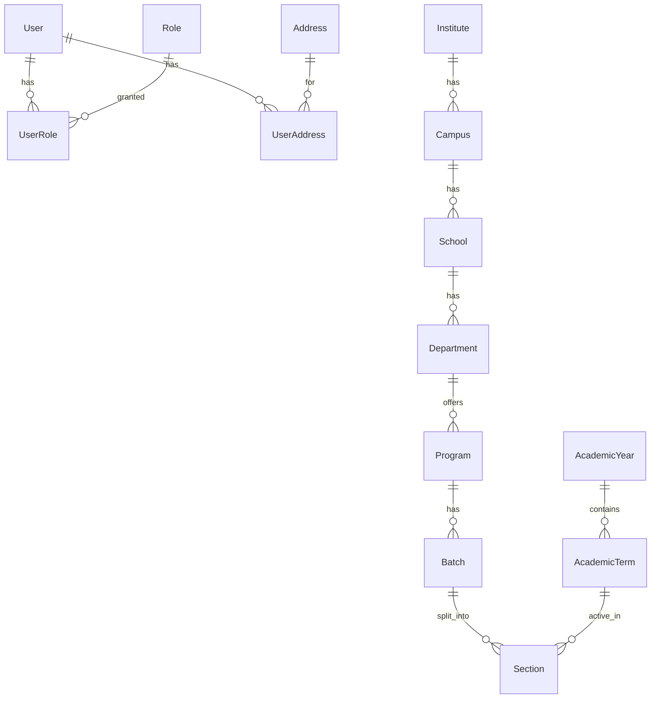
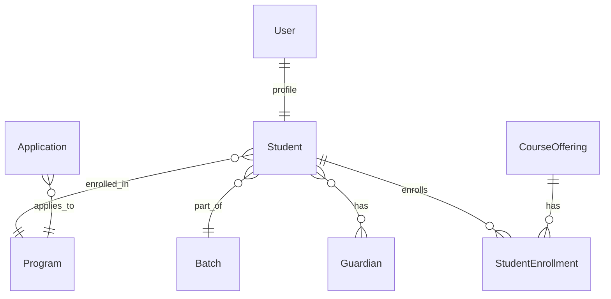
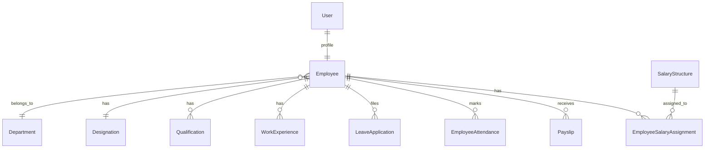
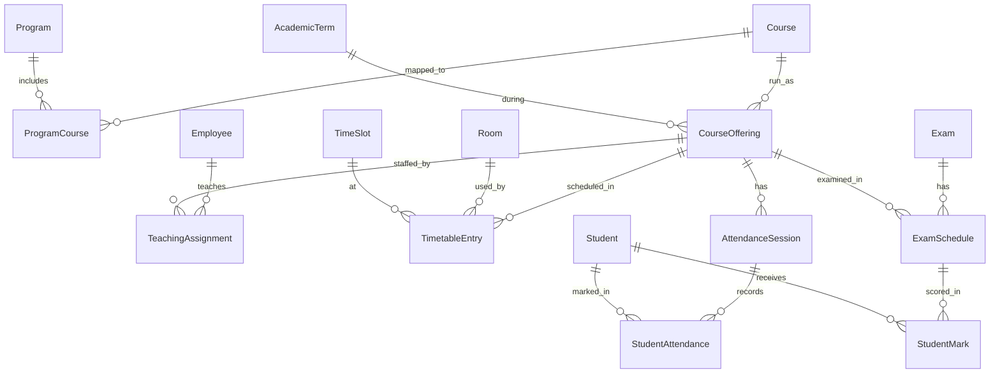
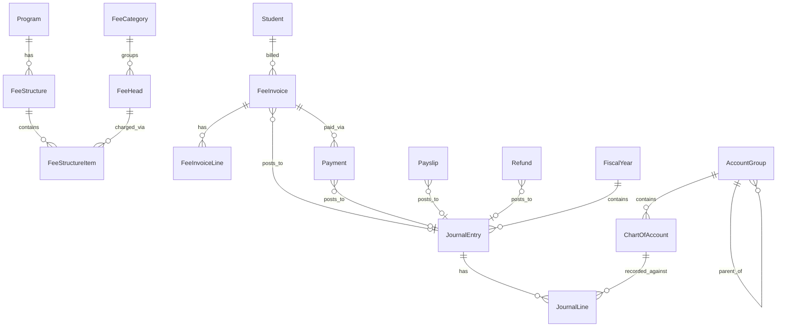
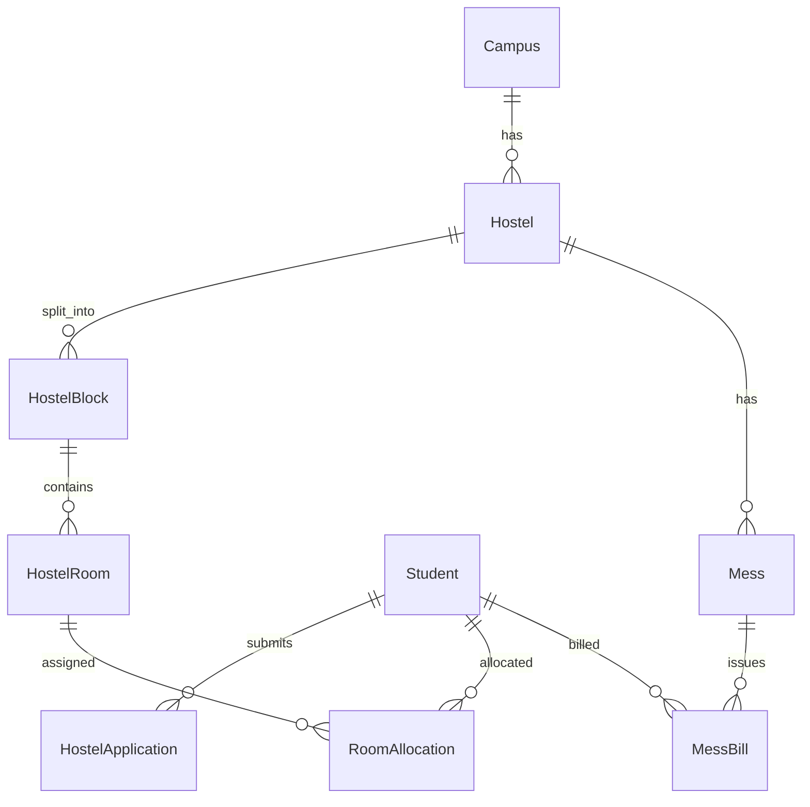
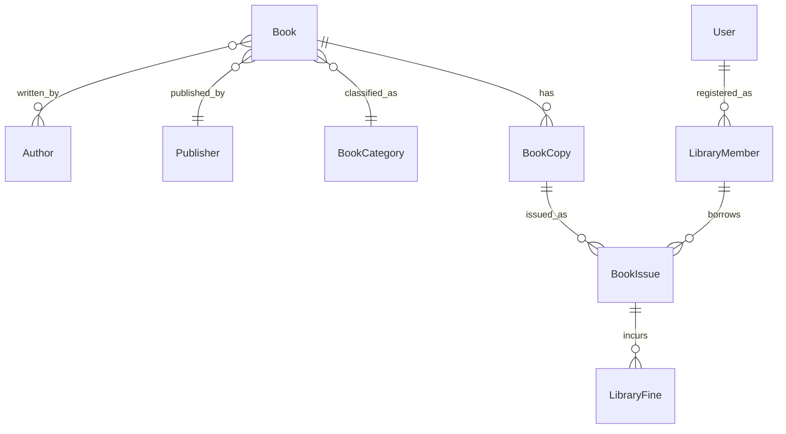
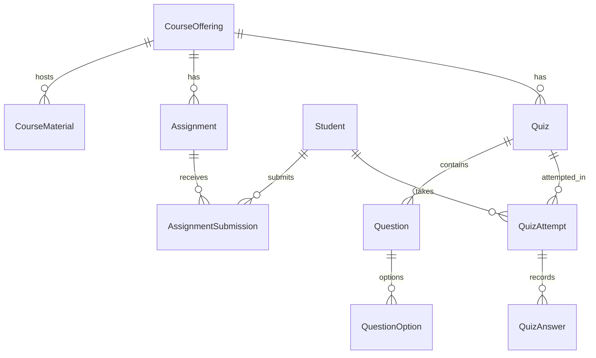
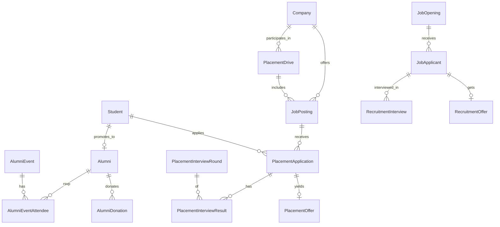

# University Management System — Database Schema (v2)

> Complete relational schema for a University Management System covering academics, students, HR, hostel, library, fees, exams, accounting, LMS, alumni, and placements. Designed for **PostgreSQL** + **Django ORM**. Transport module is intentionally excluded per the user's request.

**Changes in v2 (vs v1):**
- **Hostel:** room-level allocation (dropped `Bed` table). Capacity enforced by DB trigger/constraint.
- **Grading:** fully configurable `GradingScheme` — percentage / letter / GPA — with per-program selection and conversion rules.
- **Accounting:** added full double-entry ledger module (`FiscalYear`, `AccountGroup`, `ChartOfAccount`, `JournalEntry`, `JournalLine`). Fees, payments, payroll, refunds all post to the ledger.
- **New modules added to v1 scope:** Alumni, Placements, Staff Recruitment, LMS (Assignments, Quizzes, Materials).
- **Multi-campus ready:** Institute → Campus → School hierarchy kept. Single-campus deployment just seeds 1 row; adding more campuses later is data, not schema.

---

## 0. Design Principles

1. **One `User` is the root of identity.** Every student, teacher, HR, librarian, warden, cleaning staff is a `User` with a role discriminator; profile-specific fields live in `Student` / `Employee` 1-1 profile tables.
2. **Role-based authorization** via `Role` + `UserRole` join; plus a coarse `user_type` enum on `User` for fast filtering.
3. **Soft-delete + audit**: `created_at`, `updated_at`, `is_active` on every table. A central `AuditLog` records sensitive mutations.
4. **Academic time is explicit** — `AcademicYear`, `AcademicTerm`, `Batch`.
5. **Template vs instance** — `Course` vs `CourseOffering`; `FeeStructure` vs `FeeInvoice`; `Exam` vs `ExamSchedule`.
6. **Money in `DECIMAL(12,2)`**. Currency modeled as a lookup, default INR.
7. **Addresses normalized** into a reusable `Address` table.
8. **Enums as string `TextChoices`** (not Postgres ENUM types) — easier migrations.
9. **Every financial event posts a journal entry.** Payments, payslips, invoices, refunds, scholarships, fines all become `JournalEntry` rows. This is what "full accounting ledger" means.

---

## 1. Modules Overview

| # | Module | Purpose |
|---|---|---|
| 1 | **Core / Identity** | Users, roles, addresses, documents, contacts |
| 2 | **Organization** | Institute → Campus → School → Department |
| 3 | **Academic Structure** | Program, AcademicYear, Term, Batch, Section |
| 4 | **Courses & Curriculum** | Course, CourseOffering, Syllabus, Prerequisites |
| 5 | **Students** | Applications, Admissions, Student profile, Guardians |
| 6 | **Employees (all staff)** | Teachers, HR, Librarians, Wardens, Cleaning, Accountants |
| 7 | **HR Operations** | Designation, Qualification, Experience, Documents |
| 8 | **Payroll** | SalaryStructure, Components, Payslip |
| 9 | **Leave & Staff Attendance** | LeaveType, Application, Balance, Holiday, Attendance, Shift |
| 10 | **Student Attendance** | Per-lecture attendance |
| 11 | **Timetable & Scheduling** | Room, TimeSlot, TimetableEntry, TeachingAssignment |
| 12 | **Grading System** | Configurable: percentage / letter / GPA + conversion rules |
| 13 | **Exams & Results** | Exam, ExamSchedule, Marks, Course/Term/Cumulative results |
| 14 | **Fees** | FeeCategory, FeeStructure, Invoice, Payment, Scholarship, Refund |
| 15 | **Accounting Ledger** | FiscalYear, ChartOfAccount, JournalEntry, JournalLine |
| 16 | **Hostel** | Hostel, Block, Room, Allocation, Mess, Visitor |
| 17 | **Library** | Book, Author, Category, Copy, Loan, Reservation, Fine |
| 18 | **LMS** | Assignments, Submissions, Quizzes, Questions, Materials |
| 19 | **Alumni** | Alumni profile, events, donations |
| 20 | **Student Placements** | Company, JobPosting, Application, Offer, Drive |
| 21 | **Staff Recruitment** | JobOpening, Applicant, Interview, OfferLetter |
| 22 | **Assets / Inventory** | Asset, Vendor, Purchase, Assignment |
| 23 | **Communication** | Announcement, Notification, Event |
| 24 | **Audit & System** | AuditLog, Setting |

---

## 2. Entity Catalogue

Conventions:
- `PK` primary key (assume `BIGSERIAL id` unless stated)
- `FK → Table` foreign key
- `UQ` unique, `IDX` indexed, `NN` NOT NULL, `CK` check constraint
- Every table implicitly gets `created_at TIMESTAMPTZ`, `updated_at TIMESTAMPTZ`, `is_active BOOLEAN DEFAULT TRUE` unless noted.

### 2.1 Core / Identity

#### `User` (custom Django user)
| Column | Type | Notes |
|---|---|---|
| id | BIGSERIAL | PK |
| username | VARCHAR(150) | UQ, NN |
| email | CITEXT | UQ, NN |
| password | VARCHAR(128) | NN (hashed) |
| first_name | VARCHAR(100) | NN |
| middle_name | VARCHAR(100) | |
| last_name | VARCHAR(100) | NN |
| phone | VARCHAR(20) | IDX |
| date_of_birth | DATE | |
| gender | VARCHAR(16) | enum: male/female/other/prefer_not_to_say |
| blood_group | VARCHAR(5) | |
| profile_photo | VARCHAR(255) | |
| user_type | VARCHAR(24) | enum: `student`, `employee`, `admin`, `guardian`, `alumni`, `applicant` |
| is_staff | BOOLEAN | Django admin access |
| is_superuser | BOOLEAN | |
| last_login | TIMESTAMPTZ | |

#### `Role`
`code` UQ (e.g., `STUDENT`, `TEACHER`, `HR_MANAGER`, `LIBRARIAN`, `WARDEN`, `ACCOUNTANT`, `CLEANING_STAFF`, `PLACEMENT_COORDINATOR`, `ALUMNI_COORDINATOR`, `SUPER_ADMIN`), `name`, `description`.

#### `UserRole` (M2M User ↔ Role)
`user_id`, `role_id`, `assigned_at`, UQ(user_id, role_id).

#### `Address`
`line1`, `line2`, `city`, `state`, `postal_code`, `country`, `address_type` (`permanent`/`current`/`office`/`billing`).

#### `UserAddress` (M2M User ↔ Address with type).

#### `Document` (polymorphic attachment — any owner via GenericFK)
`owner_content_type`, `owner_id`, `name`, `doc_type` (e.g., `aadhaar`, `pan`, `marksheet_10`, `marksheet_12`, `photo`, `offer_letter`, `resume`), `file`, `uploaded_by`, `verified`.

#### `EmergencyContact` (polymorphic — student or employee)
`owner_content_type`, `owner_id`, `name`, `relation`, `phone`, `email`, `address_id`.

#### `Currency`
`code` (UQ, e.g., `INR`, `USD`), `name`, `symbol`, `is_default`.

---

### 2.2 Organization

#### `Institute`
`name`, `short_code` (UQ), `established_on`, `logo`, `website`, `email`, `phone`, `address_id`.

#### `Campus`
`institute_id` FK, `name`, `code` (UQ per institute), `address_id`.

> **Single-campus-safe:** you seed 1 Campus row at install time; every downstream table (`School`, `Hostel`, `Room`, `HostelRoom`, etc.) FKs to it. Adding another campus later is pure data — zero schema changes.

#### `School` (a.k.a. Faculty)
`campus_id`, `name`, `code`, `dean_id` → Employee.

#### `Department`
`school_id`, `name`, `code`, `hod_id` → Employee.

---

### 2.3 Academic Structure

#### `AcademicYear` — `name` (UQ, e.g. `2025-2026`), `start_date`, `end_date`, `is_current`.

#### `AcademicTerm` — `academic_year_id`, `name`, `term_type` (`semester`/`trimester`/`annual`), `start_date`, `end_date`, `is_current`.

#### `Program` — `department_id`, `name`, `code` (UQ per dept), `level` (`undergraduate`/`postgraduate`/`doctoral`/`diploma`), `duration_years`, `total_terms`, `total_credits`, `grading_scheme_id` FK → GradingScheme, `description`.

#### `Batch` — `program_id`, `name`, `start_year`, `end_year`, `max_strength`.

#### `Section` — `batch_id`, `term_id`, `name`, `class_teacher_id` → Employee, `max_strength`.

---

### 2.4 Courses & Curriculum

#### `Course` (catalogue) — `department_id`, `code` (UQ), `title`, `credits`, `course_type` (`core`/`elective`/`lab`/`project`/`seminar`), `theory_hours`, `practical_hours`, `description`.

#### `CoursePrerequisite` (self M2M) — `course_id`, `prereq_course_id`, UQ.

#### `ProgramCourse` — `program_id`, `course_id`, `term_number` (1..N), `is_mandatory`.

#### `CourseOffering` (an instance of a course in a term) — `course_id`, `term_id`, `section_id` (nullable), `primary_teacher_id` → Employee, `room_id` → Room, `capacity`.

#### `TeachingAssignment` — `offering_id`, `employee_id`, `role` (`lecturer`/`ta`/`lab_instructor`).

#### `SyllabusTopic` — `course_id`, `unit_number`, `title`, `description`, `expected_hours`.

---

### 2.5 Students

#### `Application` (admission application)
`application_no` (UQ), `program_id`, applicant details (first_name, last_name, email, phone, dob, gender), `previous_qualification`, `previous_percentage`, `entrance_exam`, `entrance_score`, `status` (`submitted`/`under_review`/`shortlisted`/`offered`/`accepted`/`rejected`/`withdrawn`), `applied_on`, `decision_on`.

#### `Student` (1-1 with User)
`user_id` (UQ), `enrollment_no` (UQ), `roll_no` (UQ per batch+section), `program_id`, `batch_id`, `current_term_id`, `current_section_id`, `admission_date`, `admission_type` (`regular`/`lateral`/`transfer`), `category` (`general`/`obc`/`sc`/`st`/`ews`), `religion`, `nationality`, `blood_group`, `aadhaar_no` (encrypted), `pan_no`, `status` (`active`/`on_leave`/`graduated`/`dropped`/`suspended`/`transferred`).

#### `Guardian` — `user_id` (nullable), `name`, `relation` (`father`/`mother`/`guardian`/`spouse`/`sibling`), `occupation`, `annual_income`, `phone`, `email`, `address_id`.

#### `StudentGuardian` — `student_id`, `guardian_id`, `is_primary`.

#### `StudentEnrollment` (into a course offering)
`student_id`, `offering_id`, `enrolled_on`, `status` (`enrolled`/`dropped`/`completed`/`failed`), UQ(student_id, offering_id).

---

### 2.6 Employees

#### `Designation` — `name` (UQ), `category` (`teaching`/`non_teaching`/`admin`/`support`).

> Examples: *Professor*, *Assistant Professor*, *HR Manager*, *Librarian*, *Hostel Warden*, *Cleaning Staff*, *Accountant*, *Lab Assistant*, *Placement Officer*.

#### `Employee` (1-1 with User)
`user_id` (UQ), `employee_no` (UQ), `department_id` (nullable), `designation_id`, `reports_to_id` → Employee, `employment_type` (`permanent`/`contract`/`visiting`/`adjunct`/`intern`), `joining_date`, `confirmation_date`, `exit_date`, `status` (`active`/`on_leave`/`resigned`/`terminated`/`retired`), `pan_no`, `aadhaar_no`, `pf_no`, `uan_no`, `bank_account_no` (encrypted), `bank_ifsc`.

#### `Qualification` (edu history) — `employee_id`, `degree`, `institution`, `year`, `percentage`, `specialization`.

#### `WorkExperience` — `employee_id`, `company`, `role`, `start_date`, `end_date`, `description`.

---

### 2.7 Payroll

#### `SalaryComponent` — `code` (UQ, e.g., `BASIC`, `HRA`, `DA`, `PF`, `TDS`), `name`, `component_type` (`earning`/`deduction`), `is_taxable`.

#### `SalaryStructure` — `name`, `effective_from`.

#### `SalaryStructureComponent` — `structure_id`, `component_id`, `amount` fixed, or `percentage_of` (FK to another component), or `formula` (string).

#### `EmployeeSalaryAssignment` — `employee_id`, `structure_id`, `effective_from`, `effective_to`.

#### `Payslip` — `employee_id`, `period_start`, `period_end`, `gross_earnings`, `total_deductions`, `net_pay`, `status` (`draft`/`approved`/`paid`), `paid_on`, `journal_entry_id` FK → JournalEntry (nullable, set when approved).

#### `PayslipLine` — one row per component actually paid: `payslip_id`, `component_id`, `amount`.

---

### 2.8 Leave & Staff Attendance

#### `LeaveType` — `name`, `code`, `is_paid`.

#### `LeavePolicy` — quotas per (designation/employment_type, leave_type, per_year).

#### `LeaveBalance` — `employee_id`, `leave_type_id`, `year`, `balance`.

#### `LeaveApplication` — `employee_id`, `leave_type_id`, `from_date`, `to_date`, `half_day`, `reason`, `status` (`pending`/`approved`/`rejected`/`cancelled`), `approved_by_id`, `approved_on`.

#### `Holiday` + `HolidayList` — holidays per academic year, reused for staff and students.

#### `Shift` — `name`, `start_time`, `end_time`, `grace_minutes`.

#### `EmployeeAttendance` — `employee_id`, `date` (UQ with employee), `shift_id`, `check_in`, `check_out`, `status` (`present`/`absent`/`late`/`half_day`/`on_leave`/`holiday`/`weekly_off`), `source` (`manual`/`biometric`/`import`).

---

### 2.9 Student Attendance

#### `AttendanceSession` (a lecture) — `offering_id`, `date`, `start_time`, `end_time`, `room_id`, `taken_by_id` → Employee, UQ(offering_id, date, start_time).

#### `StudentAttendance` — `session_id`, `student_id`, `status` (`present`/`absent`/`late`/`excused`), `remarks`, UQ(session_id, student_id).

---

### 2.10 Timetable & Scheduling

#### `Room` — `campus_id`, `building`, `floor`, `room_no`, `room_type` (`lecture_hall`/`lab`/`seminar`/`auditorium`/`tutorial`), `capacity`, `has_projector`, `has_ac`.

#### `TimeSlot` — `day_of_week` (0..6), `start_time`, `end_time`, `name` (e.g., *Period 1*).

#### `TimetableEntry` — `section_id`, `offering_id`, `time_slot_id`, `teacher_id` → Employee, `room_id`, `effective_from`, `effective_to`.

DB-level UQ constraints to prevent clashes:
- UQ(time_slot_id, teacher_id)
- UQ(time_slot_id, room_id)
- UQ(time_slot_id, section_id)

---

### 2.11 Grading System (configurable)

#### `GradingScheme`
| Column | Type | Notes |
|---|---|---|
| id | BIGSERIAL | PK |
| name | VARCHAR(128) | e.g. *UGC 10-Point CGPA*, *Percentage System*, *Letter Grade A-F* |
| scheme_type | VARCHAR(16) | enum: `percentage`, `letter`, `gpa` |
| max_grade_points | NUMERIC(4,2) | e.g., 10.00 for 10-point GPA, NULL for percentage |
| pass_threshold | NUMERIC(6,2) | e.g., 40.00 (percentage), 4.00 (GPA), or minimum passing grade letter |
| description | TEXT | |

#### `GradeBand` (bands that make up a scheme)
| Column | Type | Notes |
|---|---|---|
| id | BIGSERIAL | PK |
| scheme_id | FK → GradingScheme | NN |
| band_code | VARCHAR(8) | e.g., `A+`, `A`, `B`, or `First Class`, or `80-89` |
| min_percentage | NUMERIC(6,2) | inclusive |
| max_percentage | NUMERIC(6,2) | inclusive |
| grade_points | NUMERIC(4,2) | GPA equivalent (nullable for pure percentage) |
| is_pass | BOOLEAN | |
| sort_order | SMALLINT | |

> A *letter* scheme defines all bands as letters; a *percentage* scheme may define bands like "First Class ≥ 60%"; a *GPA* scheme maps percentage ranges to grade_points. **Conversions are derived from this single table** — given a percentage, look up the band, read its letter + grade_points.

#### `GradeConversionRule` (optional — only if institute needs custom conversions)
| Column | Type | Notes |
|---|---|---|
| id | BIGSERIAL | PK |
| from_scheme_id | FK → GradingScheme | |
| to_scheme_id | FK → GradingScheme | |
| formula | VARCHAR(255) | e.g., `CGPA * 9.5` (common Indian 10-pt to % conversion) |

> **How `Program` uses this:** each `Program` has `grading_scheme_id`. When marks are entered, we look up the scheme's bands to produce letter + grade_points + pass/fail. Institutes can edit bands at any time; historical records store the resolved grade (not recomputed) to preserve integrity.

---

### 2.12 Exams & Results

#### `ExamType` — `name` (e.g. *Mid Sem*, *End Sem*, *Quiz*, *Assignment*, *Viva*, *Lab*).

#### `Exam` — `term_id`, `exam_type_id`, `name`, `start_date`, `end_date`.

#### `ExamSchedule` — `exam_id`, `offering_id`, `date`, `start_time`, `end_time`, `room_id`, `max_marks`, `min_passing`, `weight` (% contribution to final grade).

#### `StudentMark` — `schedule_id`, `student_id`, `marks_obtained`, `is_absent`, `remarks`, UQ(schedule_id, student_id).

#### `StudentCourseResult` (final grade per course per student — **snapshotted** once finalized)
| Column | Type | Notes |
|---|---|---|
| enrollment_id | FK → StudentEnrollment | UQ |
| total_percentage | NUMERIC(6,2) | |
| grade_band_id | FK → GradeBand | snapshot — the band as it was when finalized |
| grade_letter | VARCHAR(8) | snapshot |
| grade_points | NUMERIC(4,2) | snapshot |
| credits_earned | NUMERIC(4,1) | |
| finalized_on | DATE | |

#### `StudentTermResult` — per term: `student_id`, `term_id`, `sgpa`, `total_credits`, `percentage`.

#### `StudentCumulativeResult` — per student (rolling): `cgpa`, `percentage`, `total_credits_earned`.

> **Why snapshot?** If an institute later changes its grade band cutoffs, you don't silently change a graduated student's GPA. Re-computation is explicit.

---

### 2.13 Fees

#### `FeeCategory` — Tuition, Hostel, Exam, Library, Transport, Misc.
#### `FeeHead` — chargeable item, belongs to a category.

#### `FeeStructure` (template) — `program_id`, `batch_id` (nullable), `term_id` (nullable), `name`.

#### `FeeStructureItem` — `structure_id`, `fee_head_id`, `amount`, `is_refundable`.

#### `FeeInvoice` — `invoice_no` (UQ), `student_id`, `term_id`, `issue_date`, `due_date`, `total_amount`, `discount_amount`, `paid_amount`, `balance_amount`, `status` (`draft`/`issued`/`partial`/`paid`/`overdue`/`cancelled`), `journal_entry_id` FK → JournalEntry (nullable — populated when issued).

#### `FeeInvoiceLine` — `invoice_id`, `fee_head_id`, `amount`, `discount`.

#### `Payment` — `payment_no` (UQ), `invoice_id`, `amount`, `paid_on`, `mode` (`cash`/`card`/`upi`/`netbanking`/`cheque`/`dd`), `txn_reference`, `status` (`pending`/`success`/`failed`/`refunded`), `received_by_id` → Employee, `journal_entry_id` FK → JournalEntry.

#### `Scholarship` — `name`, `discount_type` (`percentage`/`fixed`), `value`, `source` (`institute`/`govt`/`private`).
#### `StudentScholarship` — student, scholarship, period, approved_by, status.

#### `Refund` — `payment_id`, `amount`, `reason`, `status`, `refunded_on`, `journal_entry_id`.

---

### 2.14 Accounting Ledger (double-entry)

> Every financial action in the system (issuing invoice, receiving payment, paying salary, refund, library fine) **posts a `JournalEntry` with two or more `JournalLine` rows** such that total debits = total credits.

#### `FiscalYear`
| Column | Type | Notes |
|---|---|---|
| id | BIGSERIAL | PK |
| name | VARCHAR(32) | UQ, e.g. `FY 2025-26` |
| start_date | DATE | NN |
| end_date | DATE | NN |
| is_closed | BOOLEAN | once closed, no new entries |

#### `AccountGroup` (hierarchical — `parent_id` self FK)
| Column | Type | Notes |
|---|---|---|
| id | BIGSERIAL | PK |
| name | VARCHAR(128) | |
| code | VARCHAR(32) | UQ |
| parent_id | FK → AccountGroup | nullable |
| root_type | VARCHAR(16) | enum: `asset`, `liability`, `equity`, `income`, `expense` |

Typical seed groups: *Assets > Bank Accounts*, *Assets > Cash*, *Assets > Receivables (Student Dues)*, *Liabilities > Payables*, *Income > Tuition Fee*, *Income > Hostel Fee*, *Income > Library Fines*, *Expense > Salaries*, *Expense > Utilities*.

#### `ChartOfAccount` (a.k.a. Ledger)
| Column | Type | Notes |
|---|---|---|
| id | BIGSERIAL | PK |
| code | VARCHAR(32) | UQ |
| name | VARCHAR(200) | |
| group_id | FK → AccountGroup | NN |
| account_type | VARCHAR(16) | enum mirrors `root_type` above |
| currency_id | FK → Currency | |
| is_bank | BOOLEAN | if true, balance is cash |
| opening_balance | DECIMAL(14,2) | |

#### `JournalEntry`
| Column | Type | Notes |
|---|---|---|
| id | BIGSERIAL | PK |
| entry_no | VARCHAR(32) | UQ |
| fiscal_year_id | FK → FiscalYear | |
| posting_date | DATE | NN |
| narration | VARCHAR(512) | |
| source_type | VARCHAR(32) | enum: `invoice`, `payment`, `refund`, `payslip`, `manual`, `fine`, `scholarship` |
| source_id | BIGINT | points back to the originating record |
| status | VARCHAR(16) | `draft`/`posted`/`reversed` |
| posted_by_id | FK → User | |
| posted_at | TIMESTAMPTZ | |

#### `JournalLine`
| Column | Type | Notes |
|---|---|---|
| id | BIGSERIAL | PK |
| entry_id | FK → JournalEntry | NN |
| account_id | FK → ChartOfAccount | NN |
| debit | DECIMAL(14,2) | NN, default 0 |
| credit | DECIMAL(14,2) | NN, default 0 |
| party_content_type | FK → ContentType | optional — who this line is about (student/vendor/employee) |
| party_id | BIGINT | |
| description | VARCHAR(255) | |

**CK constraint:** `(debit > 0 AND credit = 0) OR (credit > 0 AND debit = 0)`.
**DB-level invariant:** per `JournalEntry`, SUM(debit) = SUM(credit). Enforced at application layer + DB trigger.

#### Example postings
- **Issue tuition invoice** (₹50,000): DR *Student Receivables* 50,000 / CR *Tuition Income* 50,000.
- **Receive payment** (₹30,000 by UPI): DR *Bank — UPI* 30,000 / CR *Student Receivables* 30,000.
- **Pay salary** (₹80,000 net, ₹90,000 gross, ₹10,000 PF): DR *Salary Expense* 90,000 / CR *Bank* 80,000 / CR *PF Payable* 10,000.

---

### 2.15 Hostel

#### `Hostel` — `campus_id`, `name`, `hostel_type` (`boys`/`girls`/`co_ed`), `warden_id` → Employee, `address_id`.

#### `HostelBlock` — `hostel_id`, `name` (A, B, C), UQ(hostel_id, name).

#### `HostelFloor` (optional grouping) — `block_id`, `floor_number`, UQ.

#### `HostelRoom`
| Column | Type | Notes |
|---|---|---|
| id | BIGSERIAL | PK |
| block_id | FK → HostelBlock | NN |
| floor_number | SMALLINT | |
| room_no | VARCHAR(16) | |
| room_type | VARCHAR(16) | `single`, `double`, `triple`, `quad`, `dorm` |
| capacity | SMALLINT | NN, CK capacity > 0 |
| monthly_rent | DECIMAL(10,2) | |
| status | VARCHAR(16) | `available`/`occupied`/`under_maintenance`/`reserved` |
| (block_id, room_no) UQ |

#### `HostelApplication` — `student_id`, `preferred_hostel_id`, `preferred_room_type`, `applied_on`, `status` (`pending`/`approved`/`rejected`/`cancelled`).

#### `RoomAllocation` (room-level — capacity enforced)
| Column | Type | Notes |
|---|---|---|
| id | BIGSERIAL | PK |
| student_id | FK → Student | NN |
| room_id | FK → HostelRoom | NN |
| check_in_date | DATE | NN |
| check_out_date | DATE | nullable |
| status | VARCHAR(16) | `active`/`vacated` |

**DB-level constraints:**
- Partial UQ index: `(student_id) WHERE status='active'` — student can only have 1 active allocation.
- Capacity enforced via DB trigger OR application logic: `COUNT(*) FROM RoomAllocation WHERE room_id=X AND status='active'` must be ≤ `HostelRoom.capacity`.

#### `Mess` — `hostel_id`, `name`, `manager_id` → Employee.

#### `MessMenu` — `mess_id`, `day_of_week`, `meal_type` (`breakfast`/`lunch`/`snacks`/`dinner`), `items` (TEXT).

#### `MessBill` — `student_id`, `mess_id`, `period_start`, `period_end`, `amount`, `status`, `invoice_id` FK → FeeInvoice (nullable — ties into fee system).

#### `HostelVisitor` — `student_id`, `visitor_name`, `relation`, `phone`, `id_proof_type`, `id_proof_no`, `check_in`, `check_out`.

#### `HostelLeave` (night out / outing) — `student_id`, `from_date`, `to_date`, `reason`, `approved_by_id` → Employee, `status`.

---

### 2.16 Library

#### `Author` — `name`, `bio`.
#### `Publisher` — `name`, `address`.
#### `BookCategory` — `name`, `parent_id` self FK.

#### `Book` — `isbn` (UQ IDX), `title`, `edition`, `publisher_id`, `category_id`, `publication_year`, `language`, `total_pages`.

#### `BookAuthor` (M2M) — `book_id`, `author_id`, UQ.

#### `BookCopy` — `book_id`, `accession_no` (UQ), `barcode`, `rack_no`, `price`, `condition` (`new`/`good`/`damaged`/`lost`/`withdrawn`), `status` (`available`/`issued`/`reserved`/`lost`/`in_repair`).

#### `LibraryMember` — `user_id`, `member_type` (`student`/`faculty`/`staff`), `max_books`, `membership_expiry`, UQ(user_id, member_type).

#### `BookIssue` — `member_id`, `copy_id`, `issued_on`, `due_date`, `returned_on`, `issued_by_id`, `returned_to_id`, `fine_amount`, `status` (`issued`/`returned`/`overdue`/`lost`).

#### `BookReservation` — `member_id`, `book_id`, `reserved_on`, `status`.

#### `LibraryFine` — `issue_id`, `member_id`, `amount`, `paid`, `payment_id` FK → Payment (nullable), `journal_entry_id`.

---

### 2.17 LMS (Learning Management)

#### `CourseMaterial` (lecture notes, slides, videos, links)
| Column | Type | Notes |
|---|---|---|
| id | BIGSERIAL | PK |
| offering_id | FK → CourseOffering | NN |
| uploaded_by_id | FK → Employee | |
| title | VARCHAR(200) | |
| material_type | VARCHAR(16) | `document`/`slide`/`video`/`link`/`note` |
| file | VARCHAR(512) | |
| external_url | VARCHAR(512) | |
| unit_number | SMALLINT | maps to syllabus unit |
| visibility | VARCHAR(16) | `enrolled`/`department`/`public` |
| published_at | TIMESTAMPTZ | |

#### `Assignment` — `offering_id`, `title`, `description`, `max_marks`, `weight` (% of final), `assigned_on`, `due_on`, `late_submission_allowed`, `late_penalty_pct`.

#### `AssignmentSubmission` — `assignment_id`, `student_id`, `submitted_on`, `file` or `text`, `is_late`, `marks_obtained`, `graded_by_id` → Employee, `graded_on`, `feedback`, UQ(assignment_id, student_id).

#### `Quiz` — `offering_id`, `title`, `description`, `total_marks`, `duration_minutes`, `max_attempts`, `opens_at`, `closes_at`, `shuffle_questions`.

#### `Question` — `quiz_id`, `text`, `question_type` (`mcq_single`/`mcq_multi`/`true_false`/`short_answer`/`long_answer`), `marks`, `order`.

#### `QuestionOption` — `question_id`, `text`, `is_correct`, `order`.

#### `QuizAttempt` — `quiz_id`, `student_id`, `started_at`, `submitted_at`, `score`, `status` (`in_progress`/`submitted`/`graded`).

#### `QuizAnswer` — `attempt_id`, `question_id`, `selected_option_ids` (JSONB), `text_answer`, `marks_awarded`, `is_correct`.

#### `Discussion` / `DiscussionPost` (optional forum per offering).

---

### 2.18 Alumni

#### `Alumni` (1-1 with User; promoted from Student on graduation)
| Column | Type | Notes |
|---|---|---|
| id | BIGSERIAL | PK |
| user_id | FK → User | UQ, NN |
| student_id | FK → Student | UQ — historical link |
| graduation_year | SMALLINT | |
| program_id | FK → Program | |
| current_company | VARCHAR(200) | |
| current_designation | VARCHAR(200) | |
| industry | VARCHAR(100) | |
| location | VARCHAR(200) | |
| linkedin_url | VARCHAR(255) | |
| willing_to_mentor | BOOLEAN | |
| willing_to_hire | BOOLEAN | |

#### `AlumniEvent` — `title`, `description`, `event_date`, `location`, `organized_by_id`.

#### `AlumniEventAttendee` — `event_id`, `alumni_id`, `status` (`invited`/`registered`/`attended`/`declined`).

#### `AlumniDonation` — `alumni_id`, `amount`, `purpose`, `donated_on`, `payment_id`, `journal_entry_id`.

---

### 2.19 Student Placements

#### `Company` (recruiter) — `name` (UQ), `website`, `industry`, `hr_contact_name`, `hr_email`, `hr_phone`, `address_id`, `tier` (`tier1`/`tier2`/`tier3`), `is_active`.

#### `PlacementDrive` — `name`, `company_id`, `drive_date`, `on_campus`, `coordinator_id` → Employee, `status` (`upcoming`/`ongoing`/`completed`/`cancelled`).

#### `JobPosting` (for students)
| Column | Type | Notes |
|---|---|---|
| id | BIGSERIAL | PK |
| drive_id | FK → PlacementDrive | nullable |
| company_id | FK → Company | NN |
| title | VARCHAR(200) | |
| description | TEXT | |
| job_type | VARCHAR(16) | `fulltime`/`internship`/`ppi` |
| ctc | DECIMAL(12,2) | lpa |
| stipend | DECIMAL(10,2) | |
| location | VARCHAR(200) | |
| eligible_programs | M2M → Program | |
| eligible_batches | M2M → Batch | |
| min_cgpa | NUMERIC(4,2) | |
| max_backlogs | SMALLINT | |
| application_deadline | DATE | |
| status | VARCHAR(16) | `open`/`closed` |

#### `PlacementApplication` — `posting_id`, `student_id`, `applied_on`, `resume_id` FK → Document, `status` (`applied`/`shortlisted`/`interview`/`selected`/`rejected`/`withdrawn`), UQ(posting_id, student_id).

#### `PlacementInterviewRound` — `posting_id`, `name` (e.g. *Online Test*, *Technical 1*, *HR*), `round_number`, `scheduled_on`.

#### `PlacementInterviewResult` — `application_id`, `round_id`, `result` (`pass`/`fail`/`on_hold`), `feedback`.

#### `PlacementOffer` — `application_id`, `offered_on`, `ctc`, `role`, `joining_location`, `joining_date`, `offer_letter_doc_id`, `status` (`offered`/`accepted`/`rejected`/`revoked`).

---

### 2.20 Staff Recruitment

#### `JobOpening` — `department_id`, `designation_id`, `title`, `description`, `no_of_positions`, `experience_required`, `salary_range_min`, `salary_range_max`, `opened_on`, `closes_on`, `status` (`open`/`closed`/`on_hold`).

#### `JobApplicant` — `opening_id`, `first_name`, `last_name`, `email`, `phone`, `resume_doc_id`, `current_company`, `current_ctc`, `expected_ctc`, `notice_period_days`, `applied_on`, `status` (`applied`/`screening`/`interview`/`offered`/`hired`/`rejected`/`withdrawn`).

#### `RecruitmentInterview` — `applicant_id`, `round_number`, `interview_date`, `interviewer_ids` M2M → Employee, `mode` (`in_person`/`video`/`phone`), `feedback`, `result`.

#### `RecruitmentOffer` — `applicant_id`, `designation_id`, `ctc`, `joining_date`, `offer_letter_doc_id`, `status` (`offered`/`accepted`/`declined`/`joined`).

> When `RecruitmentOffer.status = joined`, an `Employee` record is auto-created.

---

### 2.21 Assets & Inventory

#### `Vendor` — `name`, `gstin`, `contact_name`, `phone`, `email`, `address_id`.
#### `AssetCategory` — `name`, `parent_id` self FK.

#### `Asset` — `asset_code` (UQ), `name`, `category_id`, `purchase_date`, `purchase_price`, `vendor_id`, `location_id` FK → Room, `status` (`in_use`/`in_store`/`under_repair`/`disposed`).

#### `AssetAssignment` — `asset_id`, `assigned_to_content_type`+`assigned_to_id` (polymorphic to Employee or Room), `assigned_on`, `returned_on`.

#### `Purchase` — `vendor_id`, `po_no`, `po_date`, `total_amount`, `status`, `journal_entry_id`.

#### `PurchaseItem` — `purchase_id`, `description`, `quantity`, `unit_price`, `total_price`, `asset_category_id`.

---

### 2.22 Communication

#### `Announcement` — `title`, `body`, `audience_rule` (JSONB — e.g. `{"batch_ids":[...]}` or `{"role":"STUDENT"}`), `published_at`, `expires_at`, `author_id` → User.

#### `Notification` — `user_id`, `channel` (`inapp`/`email`/`sms`/`push`), `title`, `message`, `read_at`, `created_at`.

#### `Event` (calendar) — `title`, `description`, `start_at`, `end_at`, `location`, `organizer_id`, `audience_rule` (JSONB).

---

### 2.23 Audit & System

#### `AuditLog` — `actor_id` → User, `action` (`create`/`update`/`delete`/`login`/`export`), `content_type_id`, `object_id`, `changes` JSONB, `ip_address` INET, `user_agent`, `created_at`.

#### `Setting` — key/value runtime config (e.g., `default_grading_scheme`, `institute_name`, `invoice_prefix`).

---

## 3. ER Diagrams (sliced, Mermaid)

### 3.1 Core & Organization


### 3.2 Students


### 3.3 Employees, HR & Payroll


### 3.4 Courses, Timetable, Attendance, Exams


### 3.5 Grading
```mermaid
erDiagram
    GradingScheme ||--o{ GradeBand : defines
    Program }o--|| GradingScheme : uses
    StudentCourseResult }o--|| GradeBand : snapshot_of
    GradingScheme ||--o{ GradeConversionRule : from
    GradingScheme ||--o{ GradeConversionRule : to
```

### 3.6 Fees & Accounting


### 3.7 Hostel


### 3.8 Library


### 3.9 LMS


### 3.10 Alumni, Placements, Recruitment


---

## 4. Key Design Decisions

1. **Custom `User` model**, with 1-1 `Student` / `Employee` / `Alumni` profile tables (not multi-table inheritance). Teachers, HR, Librarians, Wardens, Cleaning staff are all `Employee` rows distinguished by `Designation` + `Role`.
2. **Template vs instance everywhere**: Course vs CourseOffering, FeeStructure vs FeeInvoice, Exam vs ExamSchedule, SalaryStructure vs Payslip.
3. **Grading is data, not code**: `GradingScheme` + `GradeBand` let institutes redefine cutoffs and conversion without code changes. Results are **snapshotted** at finalize-time so historic records don't silently change when admins edit bands.
4. **Hostel allocation at room-level**: multiple active `RoomAllocation` rows per room up to `capacity`. Enforced via DB trigger.
5. **Double-entry ledger for real**: every money-moving operation (issue invoice, collect payment, pay salary, refund, library fine) calls a service that posts a balanced `JournalEntry`. Reports (Trial Balance, P&L, Student Ledger) are SQL against `JournalLine`.
6. **Polymorphic `Document`, `EmergencyContact`, `AssetAssignment`, `JournalLine.party`** via Django GenericForeignKey — DRY without tons of FK columns.
7. **Soft delete + central `AuditLog`** for compliance.
8. **Multi-campus-ready, single-campus-safe**: the hierarchy stays; single-campus deployment seeds 1 Campus row. No migrations needed to add campuses later.

---

## 5. Things I Want to Double-Check with You (before I write code)

These are small decisions where I want your explicit okay, because they change the data model and are painful to reverse later:

1. **Default currency = INR**, a single-currency system in v1 (Currency table exists but used as a lookup, not for multi-currency conversions). Good?
2. **Student `enrollment_no` format** — do you want me to generate it automatically (e.g., `2024CSE001`)? If so, what format? If not, it's entered manually at admission.
3. **Library: can faculty and staff also borrow books**? (I've modeled `LibraryMember.member_type` to allow it.)
4. **Timetable clashes** — should the system *prevent* (hard constraint) or *warn on* (soft) double-booking a teacher/room? (Default: hard — DB-level unique.)
5. **Student fee invoices** — generated *per term* (1 invoice per student per term) or *per fee head* (many invoices)? Default: per term, consolidated. Good?
6. **Who "owns" accounting postings** — do you want a dedicated *Accountant* role that reviews and posts all journal entries, or should the system auto-post them (e.g., the moment a payment succeeds)? Default: auto-post on state change, with reversal support.
7. **Quiz auto-grading** — MCQs auto-graded, short/long answers manually graded by teachers. Good?
8. **Alumni promotion** — when a student's `status` becomes `graduated`, auto-create an `Alumni` row. Good?

You can either reply "yes to all defaults" or flag the ones you want different. Once confirmed, I'll start implementing the Django project in a repo and open a PR.

---

## 6. What I'll Build Next (after your sign-off)

- Initialize Django project `ums-backend/` with PostgreSQL settings.
- Create one Django app per module (approx. 24 apps). Each app has `models.py`, admin registration, and basic factory/fixture for seed data.
- Add `AUTH_USER_MODEL = 'core.User'` before the first migration (important: cannot change later easily).
- Run `makemigrations` + `migrate`.
- Seed: 1 institute, 1 campus, roles, designations, a default grading scheme (UGC 10-point), fee categories, leave types, chart of accounts.
- Wire up Django Admin so you can immediately click around and inspect the data model.
- Open a PR.
- Then we move to REST APIs (recommended: DRF + drf-spectacular for OpenAPI) in a follow-up PR.
